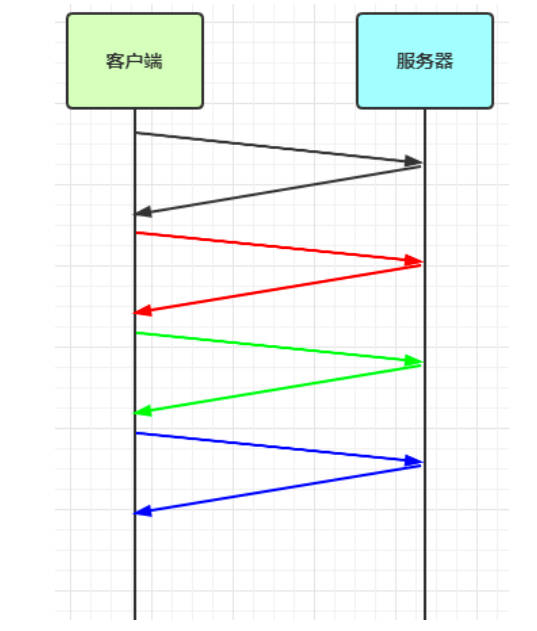
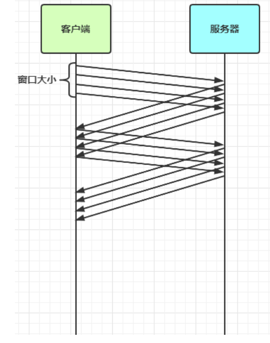

## 现象分析

### 粘包

**现象**：发送 abc 、def两次消息，实际接收 abcdef一次消息


**原因**

* 应用层：接收方 ByteBuf 设置太大（Netty 默认 1024）
* 滑动窗口：假设发送方 256 bytes 表示一个完整报文，但由于接收方处理不及时且窗口大小足够大，这 256 bytes 字节就会缓冲在接收方的滑动窗口中，当滑动窗口中缓冲了多个报文就会粘包
* Nagle 算法：会造成粘包


### 半包

**现象**：发送 abcdef一次消息，接收 abc、 def两次消息


**原因**

* 应用层：接收方 ByteBuf 小于实际发送数据量
* 滑动窗口：假设接收方的窗口只剩了 128 bytes，发送方的报文大小是 256 bytes，这时放不下了，只能先发送前 128 bytes，等待 ack 后才能发送剩余部分，这就造成了半包
* MSS 限制：当发送的数据超过 MSS 限制后，会将数据切分发送，就会造成半包


### 滑动窗口

TCP 以一个段（segment）为单位，每发送一个段就需要进行一次确认应答（ack）处理，但如果这么做，缺点是包的往返时间越长性能就越差




为了解决此问题，引入了窗口概念，窗口大小即决定了无需等待应答而可以继续发送的数据最大值




窗口实际就起到一个缓冲区的作用，同时也能起到流量控制的作用

* 图中深色的部分即要发送的数据，高亮的部分即窗口
* 窗口内的数据才允许被发送，当应答未到达前，窗口必须停止滑动
* 如果 1001~2000 这个段的数据 ack 回来了，窗口就可以向前滑动
* 接收方也会维护一个窗口，只有落在窗口内的数据才能允许接收


### MSS限制

* 链路层对一次能够发送的最大数据有限制，这个限制称之为 MTU（maximum transmission unit），不同的链路设备的 MTU 值也有所不同，例如

 * 以太网的 MTU 是 1500
 * FDDI（光纤分布式数据接口）的 MTU 是 4352
 * 本地回环地址的 MTU 是 65535 - 本地测试不走网卡

* MSS 是最大段长度（maximum segment size），它是 MTU 刨去 tcp 头和 ip 头后剩余能够作为数据传输的字节数

 * ipv4 tcp 头占用 20 bytes，ip 头占用 20 bytes，因此以太网 MSS 的值为 1500 - 40 = 1460
 * TCP 在传递大量数据时，会按照 MSS 大小将数据进行分割发送
 * MSS 的值在三次握手时通知对方自己 MSS 的值，然后在两者之间选择一个小值作为 MSS


### Nagle算法

* 即使发送一个字节，也需要加入 tcp 头和 ip 头，也就是总字节数会使用 41 bytes，非常不经济。因此为了提高网络利用率，tcp 希望尽可能发送足够大的数据，这就是 Nagle 算法产生的缘由
* 该算法是指发送端即使还有应该发送的数据，但如果这部分数据很少的话，则进行延迟发送
  * 如果 SO_SNDBUF 的数据达到 MSS，则需要发送
  * 如果 SO_SNDBUF 中含有 FIN（表示需要连接关闭）这时将剩余数据发送，再关闭
  * 如果 TCP_NODELAY = true，则需要发送
  * 已发送的数据都收到 ack 时，则需要发送
  * 上述条件不满足，但发生超时（一般为 200ms）则需要发送
  * 除上述情况，延迟发送


## 解决方案

1. 短链接，发一个包建立一次连接，这样连接建立到连接断开之间就是消息的边界，缺点效率太低
2. 每一条消息采用固定长度，缺点浪费空间
3. 每一条消息采用分隔符，例如 \n，缺点需要转义
4. 每一条消息分为 head 和 body，head 中包含 body 的长度


### 短链接

#### 服务端

```java
package mao.t1;

import io.netty.bootstrap.ServerBootstrap;
import io.netty.buffer.ByteBuf;
import io.netty.channel.Channel;
import io.netty.channel.ChannelHandlerContext;
import io.netty.channel.ChannelInboundHandlerAdapter;
import io.netty.channel.ChannelInitializer;
import io.netty.channel.nio.NioEventLoopGroup;
import io.netty.channel.socket.nio.NioServerSocketChannel;
import io.netty.channel.socket.nio.NioSocketChannel;
import io.netty.handler.logging.LogLevel;
import io.netty.handler.logging.LoggingHandler;
import io.netty.util.concurrent.Future;
import io.netty.util.concurrent.GenericFutureListener;
import lombok.SneakyThrows;
import lombok.extern.slf4j.Slf4j;

import java.nio.charset.StandardCharsets;

/**
 * Project name(项目名称)：Netty_黏包与半包现象解决
 * Package(包名): mao.t1
 * Class(类名): Server
 * Author(作者）: mao
 * Author QQ：1296193245
 * GitHub：https://github.com/maomao124/
 * Date(创建日期)： 2023/3/24
 * Time(创建时间)： 21:00
 * Version(版本): 1.0
 * Description(描述)： 短链接方式解决黏包与半包问题，服务端
 */

@Slf4j
public class Server
{
    @SneakyThrows
    public static void main(String[] args)
    {
        NioEventLoopGroup boos = new NioEventLoopGroup();
        NioEventLoopGroup worker = new NioEventLoopGroup();
        Channel channel = new ServerBootstrap()
                .group(boos, worker)
                .channel(NioServerSocketChannel.class)
                .childHandler(new ChannelInitializer<NioSocketChannel>()
                {
                    @Override
                    protected void initChannel(NioSocketChannel ch) throws Exception
                    {
                        ch.pipeline().addLast(new LoggingHandler(LogLevel.DEBUG));
                        ch.pipeline().addLast(new ChannelInboundHandlerAdapter()
                        {
                            @Override
                            public void channelActive(ChannelHandlerContext ctx) throws Exception
                            {
                                log.debug("连接建立：" + ctx.channel());
                                super.channelActive(ctx);
                            }

                            @Override
                            public void channelRead(ChannelHandlerContext ctx, Object msg) throws Exception
                            {
                                ByteBuf byteBuf = (ByteBuf) msg;
                                log.debug("读事件:" + byteBuf);
                                super.channelRead(ctx, msg);
                            }

                            @Override
                            public void channelInactive(ChannelHandlerContext ctx) throws Exception
                            {
                                log.debug("连接关闭：" + ctx.channel());
                                super.channelInactive(ctx);
                            }
                        });
                    }
                })
                .bind(8080)
                .sync().channel();
        channel.closeFuture().addListener(new GenericFutureListener<Future<? super Void>>()
        {
            @Override
            public void operationComplete(Future<? super Void> future) throws Exception
            {
                boos.shutdownGracefully();
                worker.shutdownGracefully();
            }
        });
    }

}
```


#### 客户端

```java
package mao.t1;

import io.netty.bootstrap.Bootstrap;
import io.netty.buffer.ByteBuf;
import io.netty.channel.ChannelFuture;
import io.netty.channel.ChannelHandlerContext;
import io.netty.channel.ChannelInboundHandlerAdapter;
import io.netty.channel.ChannelInitializer;
import io.netty.channel.nio.NioEventLoopGroup;
import io.netty.channel.socket.SocketChannel;
import io.netty.channel.socket.nio.NioSocketChannel;
import io.netty.handler.logging.LogLevel;
import io.netty.handler.logging.LoggingHandler;
import lombok.extern.slf4j.Slf4j;

/**
 * Project name(项目名称)：Netty_黏包与半包现象解决
 * Package(包名): mao.t1
 * Class(类名): Client
 * Author(作者）: mao
 * Author QQ：1296193245
 * GitHub：https://github.com/maomao124/
 * Date(创建日期)： 2023/3/24
 * Time(创建时间)： 21:01
 * Version(版本): 1.0
 * Description(描述)： 短链接方式解决黏包与半包问题，客户端
 */

@Slf4j
public class Client
{
    public static void main(String[] args)
    {
        //发送5次消息
        for (int i = 0; i < 5; i++)
        {
            send();
        }
    }

    private static void send()
    {
        NioEventLoopGroup worker = new NioEventLoopGroup();
        try
        {
            Bootstrap bootstrap = new Bootstrap();
            bootstrap.channel(NioSocketChannel.class);
            bootstrap.group(worker);
            bootstrap.handler(new ChannelInitializer<SocketChannel>()
            {
                @Override
                protected void initChannel(SocketChannel ch) throws Exception
                {
                    ch.pipeline().addLast(new LoggingHandler(LogLevel.DEBUG));
                    ch.pipeline().addLast(new ChannelInboundHandlerAdapter()
                    {
                        @Override
                        public void channelActive(ChannelHandlerContext ctx) throws Exception
                        {
                            log.debug("sending...");
                            ByteBuf buffer = ctx.alloc().buffer();
                            buffer.writeBytes(new byte[]{0, 1, 2, 3, 4, 5, 6, 7, 8, 9, 10, 11, 12, 13, 14, 15});
                            ctx.writeAndFlush(buffer);
                            // 发完即关
                            ctx.close();
                        }
                    });
                }
            });
            ChannelFuture channelFuture = bootstrap.connect("localhost", 8080).sync();
            channelFuture.channel().closeFuture().sync();

        }
        catch (InterruptedException e)
        {
            log.error("client error", e);
        }
        finally
        {
            worker.shutdownGracefully();
        }
    }
}
```


#### 运行结果

客户端

```sh
2023-03-24  21:14:49.711  [nioEventLoopGroup-2-1] DEBUG io.netty.handler.logging.LoggingHandler:  [id: 0xf5854979, L:/127.0.0.1:49953 - R:localhost/127.0.0.1:8080] WRITE: 16B
         +-------------------------------------------------+
         |  0  1  2  3  4  5  6  7  8  9  a  b  c  d  e  f |
+--------+-------------------------------------------------+----------------+
|00000000| 00 01 02 03 04 05 06 07 08 09 0a 0b 0c 0d 0e 0f |................|
+--------+-------------------------------------------------+----------------+
2023-03-24  21:14:49.711  [nioEventLoopGroup-2-1] DEBUG io.netty.handler.logging.LoggingHandler:  [id: 0xf5854979, L:/127.0.0.1:49953 - R:localhost/127.0.0.1:8080] FLUSH
2023-03-24  21:14:49.712  [nioEventLoopGroup-2-1] DEBUG io.netty.handler.logging.LoggingHandler:  [id: 0xf5854979, L:/127.0.0.1:49953 - R:localhost/127.0.0.1:8080] CLOSE
2023-03-24  21:14:49.713  [nioEventLoopGroup-2-1] DEBUG io.netty.handler.logging.LoggingHandler:  [id: 0xf5854979, L:/127.0.0.1:49953 ! R:localhost/127.0.0.1:8080] INACTIVE
2023-03-24  21:14:49.713  [nioEventLoopGroup-2-1] DEBUG io.netty.handler.logging.LoggingHandler:  [id: 0xf5854979, L:/127.0.0.1:49953 ! R:localhost/127.0.0.1:8080] UNREGISTERED
2023-03-24  21:14:49.787  [nioEventLoopGroup-3-1] DEBUG io.netty.handler.logging.LoggingHandler:  [id: 0x72a58ebe] REGISTERED
2023-03-24  21:14:49.787  [nioEventLoopGroup-3-1] DEBUG io.netty.handler.logging.LoggingHandler:  [id: 0x72a58ebe] CONNECT: localhost/127.0.0.1:8080
2023-03-24  21:14:49.788  [nioEventLoopGroup-3-1] DEBUG io.netty.handler.logging.LoggingHandler:  [id: 0x72a58ebe, L:/127.0.0.1:49954 - R:localhost/127.0.0.1:8080] ACTIVE
2023-03-24  21:14:49.788  [nioEventLoopGroup-3-1] DEBUG mao.t1.Client:  sending...
2023-03-24  21:14:49.791  [nioEventLoopGroup-3-1] DEBUG io.netty.handler.logging.LoggingHandler:  [id: 0x72a58ebe, L:/127.0.0.1:49954 - R:localhost/127.0.0.1:8080] WRITE: 16B
         +-------------------------------------------------+
         |  0  1  2  3  4  5  6  7  8  9  a  b  c  d  e  f |
+--------+-------------------------------------------------+----------------+
|00000000| 00 01 02 03 04 05 06 07 08 09 0a 0b 0c 0d 0e 0f |................|
+--------+-------------------------------------------------+----------------+
2023-03-24  21:14:49.793  [nioEventLoopGroup-3-1] DEBUG io.netty.handler.logging.LoggingHandler:  [id: 0x72a58ebe, L:/127.0.0.1:49954 - R:localhost/127.0.0.1:8080] FLUSH
2023-03-24  21:14:49.794  [nioEventLoopGroup-3-1] DEBUG io.netty.handler.logging.LoggingHandler:  [id: 0x72a58ebe, L:/127.0.0.1:49954 - R:localhost/127.0.0.1:8080] CLOSE
2023-03-24  21:14:49.794  [nioEventLoopGroup-3-1] DEBUG io.netty.handler.logging.LoggingHandler:  [id: 0x72a58ebe, L:/127.0.0.1:49954 ! R:localhost/127.0.0.1:8080] INACTIVE
2023-03-24  21:14:49.795  [nioEventLoopGroup-3-1] DEBUG io.netty.handler.logging.LoggingHandler:  [id: 0x72a58ebe, L:/127.0.0.1:49954 ! R:localhost/127.0.0.1:8080] UNREGISTERED
2023-03-24  21:14:49.836  [nioEventLoopGroup-4-1] DEBUG io.netty.handler.logging.LoggingHandler:  [id: 0x416d4b44] REGISTERED
2023-03-24  21:14:49.837  [nioEventLoopGroup-4-1] DEBUG io.netty.handler.logging.LoggingHandler:  [id: 0x416d4b44] CONNECT: localhost/127.0.0.1:8080
2023-03-24  21:14:49.837  [nioEventLoopGroup-4-1] DEBUG io.netty.handler.logging.LoggingHandler:  [id: 0x416d4b44, L:/127.0.0.1:49955 - R:localhost/127.0.0.1:8080] ACTIVE
2023-03-24  21:14:49.837  [nioEventLoopGroup-4-1] DEBUG mao.t1.Client:  sending...
2023-03-24  21:14:49.844  [nioEventLoopGroup-4-1] DEBUG io.netty.handler.logging.LoggingHandler:  [id: 0x416d4b44, L:/127.0.0.1:49955 - R:localhost/127.0.0.1:8080] WRITE: 16B
         +-------------------------------------------------+
         |  0  1  2  3  4  5  6  7  8  9  a  b  c  d  e  f |
+--------+-------------------------------------------------+----------------+
|00000000| 00 01 02 03 04 05 06 07 08 09 0a 0b 0c 0d 0e 0f |................|
+--------+-------------------------------------------------+----------------+
2023-03-24  21:14:49.844  [nioEventLoopGroup-4-1] DEBUG io.netty.handler.logging.LoggingHandler:  [id: 0x416d4b44, L:/127.0.0.1:49955 - R:localhost/127.0.0.1:8080] FLUSH
2023-03-24  21:14:49.844  [nioEventLoopGroup-4-1] DEBUG io.netty.handler.logging.LoggingHandler:  [id: 0x416d4b44, L:/127.0.0.1:49955 - R:localhost/127.0.0.1:8080] CLOSE
2023-03-24  21:14:49.845  [nioEventLoopGroup-4-1] DEBUG io.netty.handler.logging.LoggingHandler:  [id: 0x416d4b44, L:/127.0.0.1:49955 ! R:localhost/127.0.0.1:8080] INACTIVE
2023-03-24  21:14:49.845  [nioEventLoopGroup-4-1] DEBUG io.netty.handler.logging.LoggingHandler:  [id: 0x416d4b44, L:/127.0.0.1:49955 ! R:localhost/127.0.0.1:8080] UNREGISTERED
2023-03-24  21:14:49.892  [nioEventLoopGroup-5-1] DEBUG io.netty.handler.logging.LoggingHandler:  [id: 0x868b830d] REGISTERED
2023-03-24  21:14:49.892  [nioEventLoopGroup-5-1] DEBUG io.netty.handler.logging.LoggingHandler:  [id: 0x868b830d] CONNECT: localhost/127.0.0.1:8080
2023-03-24  21:14:49.893  [nioEventLoopGroup-5-1] DEBUG io.netty.handler.logging.LoggingHandler:  [id: 0x868b830d, L:/127.0.0.1:49956 - R:localhost/127.0.0.1:8080] ACTIVE
2023-03-24  21:14:49.893  [nioEventLoopGroup-5-1] DEBUG mao.t1.Client:  sending...
2023-03-24  21:14:49.898  [nioEventLoopGroup-5-1] DEBUG io.netty.handler.logging.LoggingHandler:  [id: 0x868b830d, L:/127.0.0.1:49956 - R:localhost/127.0.0.1:8080] WRITE: 16B
         +-------------------------------------------------+
         |  0  1  2  3  4  5  6  7  8  9  a  b  c  d  e  f |
+--------+-------------------------------------------------+----------------+
|00000000| 00 01 02 03 04 05 06 07 08 09 0a 0b 0c 0d 0e 0f |................|
+--------+-------------------------------------------------+----------------+
2023-03-24  21:14:49.898  [nioEventLoopGroup-5-1] DEBUG io.netty.handler.logging.LoggingHandler:  [id: 0x868b830d, L:/127.0.0.1:49956 - R:localhost/127.0.0.1:8080] FLUSH
2023-03-24  21:14:49.898  [nioEventLoopGroup-5-1] DEBUG io.netty.handler.logging.LoggingHandler:  [id: 0x868b830d, L:/127.0.0.1:49956 - R:localhost/127.0.0.1:8080] CLOSE
2023-03-24  21:14:49.898  [nioEventLoopGroup-5-1] DEBUG io.netty.handler.logging.LoggingHandler:  [id: 0x868b830d, L:/127.0.0.1:49956 ! R:localhost/127.0.0.1:8080] INACTIVE
2023-03-24  21:14:49.898  [nioEventLoopGroup-5-1] DEBUG io.netty.handler.logging.LoggingHandler:  [id: 0x868b830d, L:/127.0.0.1:49956 ! R:localhost/127.0.0.1:8080] UNREGISTERED
2023-03-24  21:14:49.954  [nioEventLoopGroup-6-1] DEBUG io.netty.handler.logging.LoggingHandler:  [id: 0xe228bc61] REGISTERED
2023-03-24  21:14:49.955  [nioEventLoopGroup-6-1] DEBUG io.netty.handler.logging.LoggingHandler:  [id: 0xe228bc61] CONNECT: localhost/127.0.0.1:8080
2023-03-24  21:14:49.955  [nioEventLoopGroup-6-1] DEBUG io.netty.handler.logging.LoggingHandler:  [id: 0xe228bc61, L:/127.0.0.1:49957 - R:localhost/127.0.0.1:8080] ACTIVE
2023-03-24  21:14:49.955  [nioEventLoopGroup-6-1] DEBUG mao.t1.Client:  sending...
2023-03-24  21:14:49.960  [nioEventLoopGroup-6-1] DEBUG io.netty.handler.logging.LoggingHandler:  [id: 0xe228bc61, L:/127.0.0.1:49957 - R:localhost/127.0.0.1:8080] WRITE: 16B
         +-------------------------------------------------+
         |  0  1  2  3  4  5  6  7  8  9  a  b  c  d  e  f |
+--------+-------------------------------------------------+----------------+
|00000000| 00 01 02 03 04 05 06 07 08 09 0a 0b 0c 0d 0e 0f |................|
+--------+-------------------------------------------------+----------------+
2023-03-24  21:14:49.960  [nioEventLoopGroup-6-1] DEBUG io.netty.handler.logging.LoggingHandler:  [id: 0xe228bc61, L:/127.0.0.1:49957 - R:localhost/127.0.0.1:8080] FLUSH
2023-03-24  21:14:49.960  [nioEventLoopGroup-6-1] DEBUG io.netty.handler.logging.LoggingHandler:  [id: 0xe228bc61, L:/127.0.0.1:49957 - R:localhost/127.0.0.1:8080] CLOSE
2023-03-24  21:14:49.960  [nioEventLoopGroup-6-1] DEBUG io.netty.handler.logging.LoggingHandler:  [id: 0xe228bc61, L:/127.0.0.1:49957 ! R:localhost/127.0.0.1:8080] INACTIVE
2023-03-24  21:14:49.960  [nioEventLoopGroup-6-1] DEBUG io.netty.handler.logging.LoggingHandler:  [id: 0xe228bc61, L:/127.0.0.1:49957 ! R:localhost/127.0.0.1:8080] UNREGISTERED
2023-03-24  21:14:51.935  [nioEventLoopGroup-2-1] DEBUG io.netty.buffer.PoolThreadCache:  Freed 1 thread-local buffer(s) from thread: nioEventLoopGroup-2-1
2023-03-24  21:14:52.011  [nioEventLoopGroup-3-1] DEBUG io.netty.buffer.PoolThreadCache:  Freed 1 thread-local buffer(s) from thread: nioEventLoopGroup-3-1
2023-03-24  21:14:52.058  [nioEventLoopGroup-4-1] DEBUG io.netty.buffer.PoolThreadCache:  Freed 1 thread-local buffer(s) from thread: nioEventLoopGroup-4-1
2023-03-24  21:14:52.120  [nioEventLoopGroup-5-1] DEBUG io.netty.buffer.PoolThreadCache:  Freed 1 thread-local buffer(s) from thread: nioEventLoopGroup-5-1
2023-03-24  21:14:52.199  [nioEventLoopGroup-6-1] DEBUG io.netty.buffer.PoolThreadCache:  Freed 1 thread-local buffer(s) from thread: nioEventLoopGroup-6-1
```


服务端

```sh
2023-03-24  21:14:49.706  [nioEventLoopGroup-3-1] DEBUG io.netty.handler.logging.LoggingHandler:  [id: 0xfcb39f29, L:/127.0.0.1:8080 - R:/127.0.0.1:49953] REGISTERED
2023-03-24  21:14:49.706  [nioEventLoopGroup-3-1] DEBUG io.netty.handler.logging.LoggingHandler:  [id: 0xfcb39f29, L:/127.0.0.1:8080 - R:/127.0.0.1:49953] ACTIVE
2023-03-24  21:14:49.707  [nioEventLoopGroup-3-1] DEBUG mao.t1.Server:  连接建立：[id: 0xfcb39f29, L:/127.0.0.1:8080 - R:/127.0.0.1:49953]
2023-03-24  21:14:49.713  [nioEventLoopGroup-3-1] DEBUG io.netty.util.Recycler:  -Dio.netty.recycler.maxCapacityPerThread: 4096
2023-03-24  21:14:49.713  [nioEventLoopGroup-3-1] DEBUG io.netty.util.Recycler:  -Dio.netty.recycler.maxSharedCapacityFactor: 2
2023-03-24  21:14:49.713  [nioEventLoopGroup-3-1] DEBUG io.netty.util.Recycler:  -Dio.netty.recycler.linkCapacity: 16
2023-03-24  21:14:49.714  [nioEventLoopGroup-3-1] DEBUG io.netty.util.Recycler:  -Dio.netty.recycler.ratio: 8
2023-03-24  21:14:49.721  [nioEventLoopGroup-3-1] DEBUG io.netty.buffer.AbstractByteBuf:  -Dio.netty.buffer.checkAccessible: true
2023-03-24  21:14:49.721  [nioEventLoopGroup-3-1] DEBUG io.netty.buffer.AbstractByteBuf:  -Dio.netty.buffer.checkBounds: true
2023-03-24  21:14:49.724  [nioEventLoopGroup-3-1] DEBUG io.netty.util.ResourceLeakDetectorFactory:  Loaded default ResourceLeakDetector: io.netty.util.ResourceLeakDetector@3c539b8b
2023-03-24  21:14:49.737  [nioEventLoopGroup-3-1] DEBUG io.netty.handler.logging.LoggingHandler:  [id: 0xfcb39f29, L:/127.0.0.1:8080 - R:/127.0.0.1:49953] READ: 16B
         +-------------------------------------------------+
         |  0  1  2  3  4  5  6  7  8  9  a  b  c  d  e  f |
+--------+-------------------------------------------------+----------------+
|00000000| 00 01 02 03 04 05 06 07 08 09 0a 0b 0c 0d 0e 0f |................|
+--------+-------------------------------------------------+----------------+
2023-03-24  21:14:49.737  [nioEventLoopGroup-3-1] DEBUG mao.t1.Server:  读事件:PooledUnsafeDirectByteBuf(ridx: 0, widx: 16, cap: 1024)
2023-03-24  21:14:49.737  [nioEventLoopGroup-3-1] DEBUG io.netty.channel.DefaultChannelPipeline:  Discarded inbound message PooledUnsafeDirectByteBuf(ridx: 0, widx: 16, cap: 1024) that reached at the tail of the pipeline. Please check your pipeline configuration.
2023-03-24  21:14:49.738  [nioEventLoopGroup-3-1] DEBUG io.netty.channel.DefaultChannelPipeline:  Discarded message pipeline : [LoggingHandler#0, Server$1$1#0, DefaultChannelPipeline$TailContext#0]. Channel : [id: 0xfcb39f29, L:/127.0.0.1:8080 - R:/127.0.0.1:49953].
2023-03-24  21:14:49.738  [nioEventLoopGroup-3-1] DEBUG io.netty.handler.logging.LoggingHandler:  [id: 0xfcb39f29, L:/127.0.0.1:8080 - R:/127.0.0.1:49953] READ COMPLETE
2023-03-24  21:14:49.738  [nioEventLoopGroup-3-1] DEBUG io.netty.handler.logging.LoggingHandler:  [id: 0xfcb39f29, L:/127.0.0.1:8080 - R:/127.0.0.1:49953] READ COMPLETE
2023-03-24  21:14:49.739  [nioEventLoopGroup-3-1] DEBUG io.netty.handler.logging.LoggingHandler:  [id: 0xfcb39f29, L:/127.0.0.1:8080 ! R:/127.0.0.1:49953] INACTIVE
2023-03-24  21:14:49.739  [nioEventLoopGroup-3-1] DEBUG mao.t1.Server:  连接关闭：[id: 0xfcb39f29, L:/127.0.0.1:8080 ! R:/127.0.0.1:49953]
2023-03-24  21:14:49.739  [nioEventLoopGroup-3-1] DEBUG io.netty.handler.logging.LoggingHandler:  [id: 0xfcb39f29, L:/127.0.0.1:8080 ! R:/127.0.0.1:49953] UNREGISTERED
2023-03-24  21:14:49.788  [nioEventLoopGroup-3-2] DEBUG io.netty.handler.logging.LoggingHandler:  [id: 0x649051a8, L:/127.0.0.1:8080 - R:/127.0.0.1:49954] REGISTERED
2023-03-24  21:14:49.789  [nioEventLoopGroup-3-2] DEBUG io.netty.handler.logging.LoggingHandler:  [id: 0x649051a8, L:/127.0.0.1:8080 - R:/127.0.0.1:49954] ACTIVE
2023-03-24  21:14:49.789  [nioEventLoopGroup-3-2] DEBUG mao.t1.Server:  连接建立：[id: 0x649051a8, L:/127.0.0.1:8080 - R:/127.0.0.1:49954]
2023-03-24  21:14:49.801  [nioEventLoopGroup-3-2] DEBUG io.netty.handler.logging.LoggingHandler:  [id: 0x649051a8, L:/127.0.0.1:8080 - R:/127.0.0.1:49954] READ: 16B
         +-------------------------------------------------+
         |  0  1  2  3  4  5  6  7  8  9  a  b  c  d  e  f |
+--------+-------------------------------------------------+----------------+
|00000000| 00 01 02 03 04 05 06 07 08 09 0a 0b 0c 0d 0e 0f |................|
+--------+-------------------------------------------------+----------------+
2023-03-24  21:14:49.801  [nioEventLoopGroup-3-2] DEBUG mao.t1.Server:  读事件:PooledUnsafeDirectByteBuf(ridx: 0, widx: 16, cap: 1024)
2023-03-24  21:14:49.801  [nioEventLoopGroup-3-2] DEBUG io.netty.channel.DefaultChannelPipeline:  Discarded inbound message PooledUnsafeDirectByteBuf(ridx: 0, widx: 16, cap: 1024) that reached at the tail of the pipeline. Please check your pipeline configuration.
2023-03-24  21:14:49.802  [nioEventLoopGroup-3-2] DEBUG io.netty.channel.DefaultChannelPipeline:  Discarded message pipeline : [LoggingHandler#0, Server$1$1#0, DefaultChannelPipeline$TailContext#0]. Channel : [id: 0x649051a8, L:/127.0.0.1:8080 - R:/127.0.0.1:49954].
2023-03-24  21:14:49.802  [nioEventLoopGroup-3-2] DEBUG io.netty.handler.logging.LoggingHandler:  [id: 0x649051a8, L:/127.0.0.1:8080 - R:/127.0.0.1:49954] READ COMPLETE
2023-03-24  21:14:49.802  [nioEventLoopGroup-3-2] DEBUG io.netty.handler.logging.LoggingHandler:  [id: 0x649051a8, L:/127.0.0.1:8080 - R:/127.0.0.1:49954] READ COMPLETE
2023-03-24  21:14:49.802  [nioEventLoopGroup-3-2] DEBUG io.netty.handler.logging.LoggingHandler:  [id: 0x649051a8, L:/127.0.0.1:8080 ! R:/127.0.0.1:49954] INACTIVE
2023-03-24  21:14:49.802  [nioEventLoopGroup-3-2] DEBUG mao.t1.Server:  连接关闭：[id: 0x649051a8, L:/127.0.0.1:8080 ! R:/127.0.0.1:49954]
2023-03-24  21:14:49.802  [nioEventLoopGroup-3-2] DEBUG io.netty.handler.logging.LoggingHandler:  [id: 0x649051a8, L:/127.0.0.1:8080 ! R:/127.0.0.1:49954] UNREGISTERED
2023-03-24  21:14:49.839  [nioEventLoopGroup-3-3] DEBUG io.netty.handler.logging.LoggingHandler:  [id: 0x12c675d4, L:/127.0.0.1:8080 - R:/127.0.0.1:49955] REGISTERED
2023-03-24  21:14:49.839  [nioEventLoopGroup-3-3] DEBUG io.netty.handler.logging.LoggingHandler:  [id: 0x12c675d4, L:/127.0.0.1:8080 - R:/127.0.0.1:49955] ACTIVE
2023-03-24  21:14:49.839  [nioEventLoopGroup-3-3] DEBUG mao.t1.Server:  连接建立：[id: 0x12c675d4, L:/127.0.0.1:8080 - R:/127.0.0.1:49955]
2023-03-24  21:14:49.852  [nioEventLoopGroup-3-3] DEBUG io.netty.handler.logging.LoggingHandler:  [id: 0x12c675d4, L:/127.0.0.1:8080 - R:/127.0.0.1:49955] READ: 16B
         +-------------------------------------------------+
         |  0  1  2  3  4  5  6  7  8  9  a  b  c  d  e  f |
+--------+-------------------------------------------------+----------------+
|00000000| 00 01 02 03 04 05 06 07 08 09 0a 0b 0c 0d 0e 0f |................|
+--------+-------------------------------------------------+----------------+
2023-03-24  21:14:49.852  [nioEventLoopGroup-3-3] DEBUG mao.t1.Server:  读事件:PooledUnsafeDirectByteBuf(ridx: 0, widx: 16, cap: 1024)
2023-03-24  21:14:49.852  [nioEventLoopGroup-3-3] DEBUG io.netty.channel.DefaultChannelPipeline:  Discarded inbound message PooledUnsafeDirectByteBuf(ridx: 0, widx: 16, cap: 1024) that reached at the tail of the pipeline. Please check your pipeline configuration.
2023-03-24  21:14:49.853  [nioEventLoopGroup-3-3] DEBUG io.netty.channel.DefaultChannelPipeline:  Discarded message pipeline : [LoggingHandler#0, Server$1$1#0, DefaultChannelPipeline$TailContext#0]. Channel : [id: 0x12c675d4, L:/127.0.0.1:8080 - R:/127.0.0.1:49955].
2023-03-24  21:14:49.853  [nioEventLoopGroup-3-3] DEBUG io.netty.handler.logging.LoggingHandler:  [id: 0x12c675d4, L:/127.0.0.1:8080 - R:/127.0.0.1:49955] READ COMPLETE
2023-03-24  21:14:49.853  [nioEventLoopGroup-3-3] DEBUG io.netty.handler.logging.LoggingHandler:  [id: 0x12c675d4, L:/127.0.0.1:8080 - R:/127.0.0.1:49955] READ COMPLETE
2023-03-24  21:14:49.853  [nioEventLoopGroup-3-3] DEBUG io.netty.handler.logging.LoggingHandler:  [id: 0x12c675d4, L:/127.0.0.1:8080 ! R:/127.0.0.1:49955] INACTIVE
2023-03-24  21:14:49.853  [nioEventLoopGroup-3-3] DEBUG mao.t1.Server:  连接关闭：[id: 0x12c675d4, L:/127.0.0.1:8080 ! R:/127.0.0.1:49955]
2023-03-24  21:14:49.853  [nioEventLoopGroup-3-3] DEBUG io.netty.handler.logging.LoggingHandler:  [id: 0x12c675d4, L:/127.0.0.1:8080 ! R:/127.0.0.1:49955] UNREGISTERED
2023-03-24  21:14:49.894  [nioEventLoopGroup-3-4] DEBUG io.netty.handler.logging.LoggingHandler:  [id: 0x501aa2ea, L:/127.0.0.1:8080 - R:/127.0.0.1:49956] REGISTERED
2023-03-24  21:14:49.894  [nioEventLoopGroup-3-4] DEBUG io.netty.handler.logging.LoggingHandler:  [id: 0x501aa2ea, L:/127.0.0.1:8080 - R:/127.0.0.1:49956] ACTIVE
2023-03-24  21:14:49.894  [nioEventLoopGroup-3-4] DEBUG mao.t1.Server:  连接建立：[id: 0x501aa2ea, L:/127.0.0.1:8080 - R:/127.0.0.1:49956]
2023-03-24  21:14:49.907  [nioEventLoopGroup-3-4] DEBUG io.netty.handler.logging.LoggingHandler:  [id: 0x501aa2ea, L:/127.0.0.1:8080 - R:/127.0.0.1:49956] READ: 16B
         +-------------------------------------------------+
         |  0  1  2  3  4  5  6  7  8  9  a  b  c  d  e  f |
+--------+-------------------------------------------------+----------------+
|00000000| 00 01 02 03 04 05 06 07 08 09 0a 0b 0c 0d 0e 0f |................|
+--------+-------------------------------------------------+----------------+
2023-03-24  21:14:49.907  [nioEventLoopGroup-3-4] DEBUG mao.t1.Server:  读事件:PooledUnsafeDirectByteBuf(ridx: 0, widx: 16, cap: 1024)
2023-03-24  21:14:49.908  [nioEventLoopGroup-3-4] DEBUG io.netty.channel.DefaultChannelPipeline:  Discarded inbound message PooledUnsafeDirectByteBuf(ridx: 0, widx: 16, cap: 1024) that reached at the tail of the pipeline. Please check your pipeline configuration.
2023-03-24  21:14:49.908  [nioEventLoopGroup-3-4] DEBUG io.netty.channel.DefaultChannelPipeline:  Discarded message pipeline : [LoggingHandler#0, Server$1$1#0, DefaultChannelPipeline$TailContext#0]. Channel : [id: 0x501aa2ea, L:/127.0.0.1:8080 - R:/127.0.0.1:49956].
2023-03-24  21:14:49.908  [nioEventLoopGroup-3-4] DEBUG io.netty.handler.logging.LoggingHandler:  [id: 0x501aa2ea, L:/127.0.0.1:8080 - R:/127.0.0.1:49956] READ COMPLETE
2023-03-24  21:14:49.908  [nioEventLoopGroup-3-4] DEBUG io.netty.handler.logging.LoggingHandler:  [id: 0x501aa2ea, L:/127.0.0.1:8080 - R:/127.0.0.1:49956] READ COMPLETE
2023-03-24  21:14:49.908  [nioEventLoopGroup-3-4] DEBUG io.netty.handler.logging.LoggingHandler:  [id: 0x501aa2ea, L:/127.0.0.1:8080 ! R:/127.0.0.1:49956] INACTIVE
2023-03-24  21:14:49.908  [nioEventLoopGroup-3-4] DEBUG mao.t1.Server:  连接关闭：[id: 0x501aa2ea, L:/127.0.0.1:8080 ! R:/127.0.0.1:49956]
2023-03-24  21:14:49.908  [nioEventLoopGroup-3-4] DEBUG io.netty.handler.logging.LoggingHandler:  [id: 0x501aa2ea, L:/127.0.0.1:8080 ! R:/127.0.0.1:49956] UNREGISTERED
2023-03-24  21:14:49.956  [nioEventLoopGroup-3-5] DEBUG io.netty.handler.logging.LoggingHandler:  [id: 0x8a8ec4ee, L:/127.0.0.1:8080 - R:/127.0.0.1:49957] REGISTERED
2023-03-24  21:14:49.957  [nioEventLoopGroup-3-5] DEBUG io.netty.handler.logging.LoggingHandler:  [id: 0x8a8ec4ee, L:/127.0.0.1:8080 - R:/127.0.0.1:49957] ACTIVE
2023-03-24  21:14:49.957  [nioEventLoopGroup-3-5] DEBUG mao.t1.Server:  连接建立：[id: 0x8a8ec4ee, L:/127.0.0.1:8080 - R:/127.0.0.1:49957]
2023-03-24  21:14:49.967  [nioEventLoopGroup-3-5] DEBUG io.netty.handler.logging.LoggingHandler:  [id: 0x8a8ec4ee, L:/127.0.0.1:8080 - R:/127.0.0.1:49957] READ: 16B
         +-------------------------------------------------+
         |  0  1  2  3  4  5  6  7  8  9  a  b  c  d  e  f |
+--------+-------------------------------------------------+----------------+
|00000000| 00 01 02 03 04 05 06 07 08 09 0a 0b 0c 0d 0e 0f |................|
+--------+-------------------------------------------------+----------------+
2023-03-24  21:14:49.967  [nioEventLoopGroup-3-5] DEBUG mao.t1.Server:  读事件:PooledUnsafeDirectByteBuf(ridx: 0, widx: 16, cap: 1024)
2023-03-24  21:14:49.968  [nioEventLoopGroup-3-5] DEBUG io.netty.channel.DefaultChannelPipeline:  Discarded inbound message PooledUnsafeDirectByteBuf(ridx: 0, widx: 16, cap: 1024) that reached at the tail of the pipeline. Please check your pipeline configuration.
2023-03-24  21:14:49.968  [nioEventLoopGroup-3-5] DEBUG io.netty.channel.DefaultChannelPipeline:  Discarded message pipeline : [LoggingHandler#0, Server$1$1#0, DefaultChannelPipeline$TailContext#0]. Channel : [id: 0x8a8ec4ee, L:/127.0.0.1:8080 - R:/127.0.0.1:49957].
2023-03-24  21:14:49.968  [nioEventLoopGroup-3-5] DEBUG io.netty.handler.logging.LoggingHandler:  [id: 0x8a8ec4ee, L:/127.0.0.1:8080 - R:/127.0.0.1:49957] READ COMPLETE
2023-03-24  21:14:49.968  [nioEventLoopGroup-3-5] DEBUG io.netty.handler.logging.LoggingHandler:  [id: 0x8a8ec4ee, L:/127.0.0.1:8080 - R:/127.0.0.1:49957] READ COMPLETE
2023-03-24  21:14:49.968  [nioEventLoopGroup-3-5] DEBUG io.netty.handler.logging.LoggingHandler:  [id: 0x8a8ec4ee, L:/127.0.0.1:8080 ! R:/127.0.0.1:49957] INACTIVE
2023-03-24  21:14:49.968  [nioEventLoopGroup-3-5] DEBUG mao.t1.Server:  连接关闭：[id: 0x8a8ec4ee, L:/127.0.0.1:8080 ! R:/127.0.0.1:49957]
2023-03-24  21:14:49.968  [nioEventLoopGroup-3-5] DEBUG io.netty.handler.logging.LoggingHandler:  [id: 0x8a8ec4ee, L:/127.0.0.1:8080 ! R:/127.0.0.1:49957] UNREGISTERED
```


**半包用这种办法还是不好解决，因为接收方的缓冲区大小是有限的**


### 固定长度

让所有数据包长度固定（假设长度为 32 字节），服务器端加入

```java
ch.pipeline().addLast(new FixedLengthFrameDecoder(64));
```

采用这种方法后，客户端什么时候 flush 都可以


缺点是，数据包的大小不好把握

* 长度定的太大，浪费
* 长度定的太小，对某些数据包又显得不够


#### 服务端

```java
package mao.t2;

import io.netty.bootstrap.ServerBootstrap;
import io.netty.buffer.ByteBuf;
import io.netty.channel.Channel;
import io.netty.channel.ChannelHandlerContext;
import io.netty.channel.ChannelInboundHandlerAdapter;
import io.netty.channel.ChannelInitializer;
import io.netty.channel.nio.NioEventLoopGroup;
import io.netty.channel.socket.nio.NioServerSocketChannel;
import io.netty.channel.socket.nio.NioSocketChannel;
import io.netty.handler.codec.FixedLengthFrameDecoder;
import io.netty.handler.logging.LogLevel;
import io.netty.handler.logging.LoggingHandler;
import io.netty.util.concurrent.Future;
import io.netty.util.concurrent.GenericFutureListener;
import lombok.SneakyThrows;
import lombok.extern.slf4j.Slf4j;

/**
 * Project name(项目名称)：Netty_黏包与半包现象解决
 * Package(包名): mao.t2
 * Class(类名): Server
 * Author(作者）: mao
 * Author QQ：1296193245
 * GitHub：https://github.com/maomao124/
 * Date(创建日期)： 2023/3/24
 * Time(创建时间)： 21:30
 * Version(版本): 1.0
 * Description(描述)： 固定长度方式解决黏包与半包问题，服务端
 */

@Slf4j
public class Server
{
    @SneakyThrows
    public static void main(String[] args)
    {
        NioEventLoopGroup boos = new NioEventLoopGroup();
        NioEventLoopGroup worker = new NioEventLoopGroup();
        Channel channel = new ServerBootstrap()
                .group(boos, worker)
                .channel(NioServerSocketChannel.class)
                .childHandler(new ChannelInitializer<NioSocketChannel>()
                {
                    @Override
                    protected void initChannel(NioSocketChannel ch) throws Exception
                    {
                        ch.pipeline().addLast(new FixedLengthFrameDecoder(32));
                        ch.pipeline().addLast(new LoggingHandler(LogLevel.DEBUG));
                        ch.pipeline().addLast(new ChannelInboundHandlerAdapter()
                        {
                            @Override
                            public void channelActive(ChannelHandlerContext ctx) throws Exception
                            {
                                log.debug("连接建立：" + ctx.channel());
                                super.channelActive(ctx);
                            }

                            @Override
                            public void channelRead(ChannelHandlerContext ctx, Object msg) throws Exception
                            {
                                ByteBuf byteBuf = (ByteBuf) msg;
                                log.debug("读事件:" + byteBuf);
                                super.channelRead(ctx, msg);
                            }

                            @Override
                            public void channelInactive(ChannelHandlerContext ctx) throws Exception
                            {
                                log.debug("连接关闭：" + ctx.channel());
                                super.channelInactive(ctx);
                            }
                        });
                    }
                })
                .bind(8080)
                .sync().channel();
        channel.closeFuture().addListener(new GenericFutureListener<Future<? super Void>>()
        {
            @Override
            public void operationComplete(Future<? super Void> future) throws Exception
            {
                boos.shutdownGracefully();
                worker.shutdownGracefully();
            }
        });
    }
}
```


#### 客户端

```java
package mao.t2;

import io.netty.bootstrap.Bootstrap;
import io.netty.buffer.ByteBuf;
import io.netty.channel.ChannelFuture;
import io.netty.channel.ChannelHandlerContext;
import io.netty.channel.ChannelInboundHandlerAdapter;
import io.netty.channel.ChannelInitializer;
import io.netty.channel.nio.NioEventLoopGroup;
import io.netty.channel.socket.SocketChannel;
import io.netty.channel.socket.nio.NioSocketChannel;
import io.netty.handler.logging.LogLevel;
import io.netty.handler.logging.LoggingHandler;
import lombok.extern.slf4j.Slf4j;

import java.nio.charset.StandardCharsets;

/**
 * Project name(项目名称)：Netty_黏包与半包现象解决
 * Package(包名): mao.t2
 * Class(类名): Client
 * Author(作者）: mao
 * Author QQ：1296193245
 * GitHub：https://github.com/maomao124/
 * Date(创建日期)： 2023/3/24
 * Time(创建时间)： 21:26
 * Version(版本): 1.0
 * Description(描述)： 固定长度方式解决黏包与半包问题，客户端
 */

@Slf4j
public class Client
{
    public static void main(String[] args)
    {
        NioEventLoopGroup worker = new NioEventLoopGroup();
        try
        {
            Bootstrap bootstrap = new Bootstrap();
            bootstrap.channel(NioSocketChannel.class);
            bootstrap.group(worker);
            bootstrap.handler(new ChannelInitializer<SocketChannel>()
            {
                @Override
                protected void initChannel(SocketChannel ch) throws Exception
                {
                    ch.pipeline().addLast(new LoggingHandler(LogLevel.DEBUG));
                    ch.pipeline().addLast(new ChannelInboundHandlerAdapter()
                    {
                        @Override
                        public void channelActive(ChannelHandlerContext ctx) throws Exception
                        {
                            send(ctx, "123");
                            send(ctx, "hello");
                            send(ctx, "12345678901");
                            send(ctx, "j");
                            send(ctx, "dsagsagasdhaerhsdg");
                            send(ctx, "+++45678");
                        }
                    });
                }
            });
            ChannelFuture channelFuture = bootstrap.connect("localhost", 8080).sync();
            channelFuture.channel().closeFuture().sync();

        }
        catch (InterruptedException e)
        {
            log.error("client error", e);
        }
        finally
        {
            worker.shutdownGracefully();
        }
    }

    /**
     * 发送消息,固定长度32字节
     *
     * @param ctx ctx
     * @param msg 消息
     */
    private static void send(ChannelHandlerContext ctx, String msg)
    {
        ByteBuf buffer = ctx.alloc().buffer(32);
        byte[] bytes = msg.getBytes(StandardCharsets.UTF_8);
        buffer.writeBytes(bytes);
        if (bytes.length < 32)
        {
            //补齐剩下的字节
            for (int i = 0; i < 32 - bytes.length; i++)
            {
                buffer.writeByte(0);
            }
        }
        ctx.writeAndFlush(buffer);
    }
}
```


#### 运行结果

客户端

```sh
2023-03-24  21:41:01.855  [nioEventLoopGroup-2-1] DEBUG io.netty.handler.logging.LoggingHandler:  [id: 0xd0250f69, L:/127.0.0.1:55869 - R:localhost/127.0.0.1:8080] WRITE: 32B
         +-------------------------------------------------+
         |  0  1  2  3  4  5  6  7  8  9  a  b  c  d  e  f |
+--------+-------------------------------------------------+----------------+
|00000000| 31 32 33 00 00 00 00 00 00 00 00 00 00 00 00 00 |123.............|
|00000010| 00 00 00 00 00 00 00 00 00 00 00 00 00 00 00 00 |................|
+--------+-------------------------------------------------+----------------+
2023-03-24  21:41:01.855  [nioEventLoopGroup-2-1] DEBUG io.netty.handler.logging.LoggingHandler:  [id: 0xd0250f69, L:/127.0.0.1:55869 - R:localhost/127.0.0.1:8080] FLUSH
2023-03-24  21:41:01.856  [nioEventLoopGroup-2-1] DEBUG io.netty.handler.logging.LoggingHandler:  [id: 0xd0250f69, L:/127.0.0.1:55869 - R:localhost/127.0.0.1:8080] WRITE: 32B
         +-------------------------------------------------+
         |  0  1  2  3  4  5  6  7  8  9  a  b  c  d  e  f |
+--------+-------------------------------------------------+----------------+
|00000000| 68 65 6c 6c 6f 00 00 00 00 00 00 00 00 00 00 00 |hello...........|
|00000010| 00 00 00 00 00 00 00 00 00 00 00 00 00 00 00 00 |................|
+--------+-------------------------------------------------+----------------+
2023-03-24  21:41:01.856  [nioEventLoopGroup-2-1] DEBUG io.netty.handler.logging.LoggingHandler:  [id: 0xd0250f69, L:/127.0.0.1:55869 - R:localhost/127.0.0.1:8080] FLUSH
2023-03-24  21:41:01.857  [nioEventLoopGroup-2-1] DEBUG io.netty.handler.logging.LoggingHandler:  [id: 0xd0250f69, L:/127.0.0.1:55869 - R:localhost/127.0.0.1:8080] WRITE: 32B
         +-------------------------------------------------+
         |  0  1  2  3  4  5  6  7  8  9  a  b  c  d  e  f |
+--------+-------------------------------------------------+----------------+
|00000000| 31 32 33 34 35 36 37 38 39 30 31 00 00 00 00 00 |12345678901.....|
|00000010| 00 00 00 00 00 00 00 00 00 00 00 00 00 00 00 00 |................|
+--------+-------------------------------------------------+----------------+
2023-03-24  21:41:01.857  [nioEventLoopGroup-2-1] DEBUG io.netty.handler.logging.LoggingHandler:  [id: 0xd0250f69, L:/127.0.0.1:55869 - R:localhost/127.0.0.1:8080] FLUSH
2023-03-24  21:41:01.857  [nioEventLoopGroup-2-1] DEBUG io.netty.handler.logging.LoggingHandler:  [id: 0xd0250f69, L:/127.0.0.1:55869 - R:localhost/127.0.0.1:8080] WRITE: 32B
         +-------------------------------------------------+
         |  0  1  2  3  4  5  6  7  8  9  a  b  c  d  e  f |
+--------+-------------------------------------------------+----------------+
|00000000| 6a 00 00 00 00 00 00 00 00 00 00 00 00 00 00 00 |j...............|
|00000010| 00 00 00 00 00 00 00 00 00 00 00 00 00 00 00 00 |................|
+--------+-------------------------------------------------+----------------+
2023-03-24  21:41:01.857  [nioEventLoopGroup-2-1] DEBUG io.netty.handler.logging.LoggingHandler:  [id: 0xd0250f69, L:/127.0.0.1:55869 - R:localhost/127.0.0.1:8080] FLUSH
2023-03-24  21:41:01.857  [nioEventLoopGroup-2-1] DEBUG io.netty.handler.logging.LoggingHandler:  [id: 0xd0250f69, L:/127.0.0.1:55869 - R:localhost/127.0.0.1:8080] WRITE: 32B
         +-------------------------------------------------+
         |  0  1  2  3  4  5  6  7  8  9  a  b  c  d  e  f |
+--------+-------------------------------------------------+----------------+
|00000000| 64 73 61 67 73 61 67 61 73 64 68 61 65 72 68 73 |dsagsagasdhaerhs|
|00000010| 64 67 00 00 00 00 00 00 00 00 00 00 00 00 00 00 |dg..............|
+--------+-------------------------------------------------+----------------+
2023-03-24  21:41:01.857  [nioEventLoopGroup-2-1] DEBUG io.netty.handler.logging.LoggingHandler:  [id: 0xd0250f69, L:/127.0.0.1:55869 - R:localhost/127.0.0.1:8080] FLUSH
2023-03-24  21:41:01.857  [nioEventLoopGroup-2-1] DEBUG io.netty.handler.logging.LoggingHandler:  [id: 0xd0250f69, L:/127.0.0.1:55869 - R:localhost/127.0.0.1:8080] WRITE: 32B
         +-------------------------------------------------+
         |  0  1  2  3  4  5  6  7  8  9  a  b  c  d  e  f |
+--------+-------------------------------------------------+----------------+
|00000000| 2b 2b 2b 34 35 36 37 38 00 00 00 00 00 00 00 00 |+++45678........|
|00000010| 00 00 00 00 00 00 00 00 00 00 00 00 00 00 00 00 |................|
+--------+-------------------------------------------------+----------------+
2023-03-24  21:41:01.858  [nioEventLoopGroup-2-1] DEBUG io.netty.handler.logging.LoggingHandler:  [id: 0xd0250f69, L:/127.0.0.1:55869 - R:localhost/127.0.0.1:8080] FLUSH
```


服务端

```sh
2023-03-24  21:41:01.868  [nioEventLoopGroup-3-1] DEBUG io.netty.handler.logging.LoggingHandler:  [id: 0x01a6a02e, L:/127.0.0.1:8080 - R:/127.0.0.1:55869] READ: 32B
         +-------------------------------------------------+
         |  0  1  2  3  4  5  6  7  8  9  a  b  c  d  e  f |
+--------+-------------------------------------------------+----------------+
|00000000| 31 32 33 00 00 00 00 00 00 00 00 00 00 00 00 00 |123.............|
|00000010| 00 00 00 00 00 00 00 00 00 00 00 00 00 00 00 00 |................|
+--------+-------------------------------------------------+----------------+
2023-03-24  21:41:01.868  [nioEventLoopGroup-3-1] DEBUG mao.t2.Server:  读事件:PooledSlicedByteBuf(ridx: 0, widx: 32, cap: 32/32, unwrapped: PooledUnsafeDirectByteBuf(ridx: 32, widx: 192, cap: 1024))
2023-03-24  21:41:01.868  [nioEventLoopGroup-3-1] DEBUG io.netty.channel.DefaultChannelPipeline:  Discarded inbound message PooledSlicedByteBuf(ridx: 0, widx: 32, cap: 32/32, unwrapped: PooledUnsafeDirectByteBuf(ridx: 32, widx: 192, cap: 1024)) that reached at the tail of the pipeline. Please check your pipeline configuration.
2023-03-24  21:41:01.868  [nioEventLoopGroup-3-1] DEBUG io.netty.channel.DefaultChannelPipeline:  Discarded message pipeline : [FixedLengthFrameDecoder#0, LoggingHandler#0, Server$1$1#0, DefaultChannelPipeline$TailContext#0]. Channel : [id: 0x01a6a02e, L:/127.0.0.1:8080 - R:/127.0.0.1:55869].
2023-03-24  21:41:01.868  [nioEventLoopGroup-3-1] DEBUG io.netty.handler.logging.LoggingHandler:  [id: 0x01a6a02e, L:/127.0.0.1:8080 - R:/127.0.0.1:55869] READ: 32B
         +-------------------------------------------------+
         |  0  1  2  3  4  5  6  7  8  9  a  b  c  d  e  f |
+--------+-------------------------------------------------+----------------+
|00000000| 68 65 6c 6c 6f 00 00 00 00 00 00 00 00 00 00 00 |hello...........|
|00000010| 00 00 00 00 00 00 00 00 00 00 00 00 00 00 00 00 |................|
+--------+-------------------------------------------------+----------------+
2023-03-24  21:41:01.868  [nioEventLoopGroup-3-1] DEBUG mao.t2.Server:  读事件:PooledSlicedByteBuf(ridx: 0, widx: 32, cap: 32/32, unwrapped: PooledUnsafeDirectByteBuf(ridx: 64, widx: 192, cap: 1024))
2023-03-24  21:41:01.869  [nioEventLoopGroup-3-1] DEBUG io.netty.channel.DefaultChannelPipeline:  Discarded inbound message PooledSlicedByteBuf(ridx: 0, widx: 32, cap: 32/32, unwrapped: PooledUnsafeDirectByteBuf(ridx: 64, widx: 192, cap: 1024)) that reached at the tail of the pipeline. Please check your pipeline configuration.
2023-03-24  21:41:01.869  [nioEventLoopGroup-3-1] DEBUG io.netty.channel.DefaultChannelPipeline:  Discarded message pipeline : [FixedLengthFrameDecoder#0, LoggingHandler#0, Server$1$1#0, DefaultChannelPipeline$TailContext#0]. Channel : [id: 0x01a6a02e, L:/127.0.0.1:8080 - R:/127.0.0.1:55869].
2023-03-24  21:41:01.869  [nioEventLoopGroup-3-1] DEBUG io.netty.handler.logging.LoggingHandler:  [id: 0x01a6a02e, L:/127.0.0.1:8080 - R:/127.0.0.1:55869] READ: 32B
         +-------------------------------------------------+
         |  0  1  2  3  4  5  6  7  8  9  a  b  c  d  e  f |
+--------+-------------------------------------------------+----------------+
|00000000| 31 32 33 34 35 36 37 38 39 30 31 00 00 00 00 00 |12345678901.....|
|00000010| 00 00 00 00 00 00 00 00 00 00 00 00 00 00 00 00 |................|
+--------+-------------------------------------------------+----------------+
2023-03-24  21:41:01.869  [nioEventLoopGroup-3-1] DEBUG mao.t2.Server:  读事件:PooledSlicedByteBuf(ridx: 0, widx: 32, cap: 32/32, unwrapped: PooledUnsafeDirectByteBuf(ridx: 96, widx: 192, cap: 1024))
2023-03-24  21:41:01.869  [nioEventLoopGroup-3-1] DEBUG io.netty.channel.DefaultChannelPipeline:  Discarded inbound message PooledSlicedByteBuf(ridx: 0, widx: 32, cap: 32/32, unwrapped: PooledUnsafeDirectByteBuf(ridx: 96, widx: 192, cap: 1024)) that reached at the tail of the pipeline. Please check your pipeline configuration.
2023-03-24  21:41:01.869  [nioEventLoopGroup-3-1] DEBUG io.netty.channel.DefaultChannelPipeline:  Discarded message pipeline : [FixedLengthFrameDecoder#0, LoggingHandler#0, Server$1$1#0, DefaultChannelPipeline$TailContext#0]. Channel : [id: 0x01a6a02e, L:/127.0.0.1:8080 - R:/127.0.0.1:55869].
2023-03-24  21:41:01.869  [nioEventLoopGroup-3-1] DEBUG io.netty.handler.logging.LoggingHandler:  [id: 0x01a6a02e, L:/127.0.0.1:8080 - R:/127.0.0.1:55869] READ: 32B
         +-------------------------------------------------+
         |  0  1  2  3  4  5  6  7  8  9  a  b  c  d  e  f |
+--------+-------------------------------------------------+----------------+
|00000000| 6a 00 00 00 00 00 00 00 00 00 00 00 00 00 00 00 |j...............|
|00000010| 00 00 00 00 00 00 00 00 00 00 00 00 00 00 00 00 |................|
+--------+-------------------------------------------------+----------------+
2023-03-24  21:41:01.869  [nioEventLoopGroup-3-1] DEBUG mao.t2.Server:  读事件:PooledSlicedByteBuf(ridx: 0, widx: 32, cap: 32/32, unwrapped: PooledUnsafeDirectByteBuf(ridx: 128, widx: 192, cap: 1024))
2023-03-24  21:41:01.869  [nioEventLoopGroup-3-1] DEBUG io.netty.channel.DefaultChannelPipeline:  Discarded inbound message PooledSlicedByteBuf(ridx: 0, widx: 32, cap: 32/32, unwrapped: PooledUnsafeDirectByteBuf(ridx: 128, widx: 192, cap: 1024)) that reached at the tail of the pipeline. Please check your pipeline configuration.
2023-03-24  21:41:01.869  [nioEventLoopGroup-3-1] DEBUG io.netty.channel.DefaultChannelPipeline:  Discarded message pipeline : [FixedLengthFrameDecoder#0, LoggingHandler#0, Server$1$1#0, DefaultChannelPipeline$TailContext#0]. Channel : [id: 0x01a6a02e, L:/127.0.0.1:8080 - R:/127.0.0.1:55869].
2023-03-24  21:41:01.869  [nioEventLoopGroup-3-1] DEBUG io.netty.handler.logging.LoggingHandler:  [id: 0x01a6a02e, L:/127.0.0.1:8080 - R:/127.0.0.1:55869] READ: 32B
         +-------------------------------------------------+
         |  0  1  2  3  4  5  6  7  8  9  a  b  c  d  e  f |
+--------+-------------------------------------------------+----------------+
|00000000| 64 73 61 67 73 61 67 61 73 64 68 61 65 72 68 73 |dsagsagasdhaerhs|
|00000010| 64 67 00 00 00 00 00 00 00 00 00 00 00 00 00 00 |dg..............|
+--------+-------------------------------------------------+----------------+
2023-03-24  21:41:01.869  [nioEventLoopGroup-3-1] DEBUG mao.t2.Server:  读事件:PooledSlicedByteBuf(ridx: 0, widx: 32, cap: 32/32, unwrapped: PooledUnsafeDirectByteBuf(ridx: 160, widx: 192, cap: 1024))
2023-03-24  21:41:01.869  [nioEventLoopGroup-3-1] DEBUG io.netty.channel.DefaultChannelPipeline:  Discarded inbound message PooledSlicedByteBuf(ridx: 0, widx: 32, cap: 32/32, unwrapped: PooledUnsafeDirectByteBuf(ridx: 160, widx: 192, cap: 1024)) that reached at the tail of the pipeline. Please check your pipeline configuration.
2023-03-24  21:41:01.870  [nioEventLoopGroup-3-1] DEBUG io.netty.channel.DefaultChannelPipeline:  Discarded message pipeline : [FixedLengthFrameDecoder#0, LoggingHandler#0, Server$1$1#0, DefaultChannelPipeline$TailContext#0]. Channel : [id: 0x01a6a02e, L:/127.0.0.1:8080 - R:/127.0.0.1:55869].
2023-03-24  21:41:01.870  [nioEventLoopGroup-3-1] DEBUG io.netty.handler.logging.LoggingHandler:  [id: 0x01a6a02e, L:/127.0.0.1:8080 - R:/127.0.0.1:55869] READ: 32B
         +-------------------------------------------------+
         |  0  1  2  3  4  5  6  7  8  9  a  b  c  d  e  f |
+--------+-------------------------------------------------+----------------+
|00000000| 2b 2b 2b 34 35 36 37 38 00 00 00 00 00 00 00 00 |+++45678........|
|00000010| 00 00 00 00 00 00 00 00 00 00 00 00 00 00 00 00 |................|
+--------+-------------------------------------------------+----------------+
2023-03-24  21:41:01.870  [nioEventLoopGroup-3-1] DEBUG mao.t2.Server:  读事件:PooledSlicedByteBuf(ridx: 0, widx: 32, cap: 32/32, unwrapped: PooledUnsafeDirectByteBuf(ridx: 192, widx: 192, cap: 1024))
2023-03-24  21:41:01.870  [nioEventLoopGroup-3-1] DEBUG io.netty.channel.DefaultChannelPipeline:  Discarded inbound message PooledSlicedByteBuf(ridx: 0, widx: 32, cap: 32/32, unwrapped: PooledUnsafeDirectByteBuf(ridx: 192, widx: 192, cap: 1024)) that reached at the tail of the pipeline. Please check your pipeline configuration.
2023-03-24  21:41:01.870  [nioEventLoopGroup-3-1] DEBUG io.netty.channel.DefaultChannelPipeline:  Discarded message pipeline : [FixedLengthFrameDecoder#0, LoggingHandler#0, Server$1$1#0, DefaultChannelPipeline$TailContext#0]. Channel : [id: 0x01a6a02e, L:/127.0.0.1:8080 - R:/127.0.0.1:55869].
2023-03-24  21:41:01.870  [nioEventLoopGroup-3-1] DEBUG io.netty.handler.logging.LoggingHandler:  [id: 0x01a6a02e, L:/127.0.0.1:8080 - R:/127.0.0.1:55869] READ COMPLETE
```


### 固定分隔符

默认以 \n 或 \r\n 作为分隔符，如果超出指定长度仍未出现分隔符，则抛出异常

在服务端加入

```java
ch.pipeline().addLast(new LineBasedFrameDecoder(1024));
```


缺点：处理字符数据比较合适，但如果内容本身包含了分隔符（字节数据常常会有此情况），那么就会解析错误


#### 服务端

```java
package mao.t3;

import io.netty.bootstrap.ServerBootstrap;
import io.netty.buffer.ByteBuf;
import io.netty.channel.Channel;
import io.netty.channel.ChannelHandlerContext;
import io.netty.channel.ChannelInboundHandlerAdapter;
import io.netty.channel.ChannelInitializer;
import io.netty.channel.nio.NioEventLoopGroup;
import io.netty.channel.socket.nio.NioServerSocketChannel;
import io.netty.channel.socket.nio.NioSocketChannel;
import io.netty.handler.codec.FixedLengthFrameDecoder;
import io.netty.handler.codec.LineBasedFrameDecoder;
import io.netty.handler.logging.LogLevel;
import io.netty.handler.logging.LoggingHandler;
import io.netty.util.concurrent.Future;
import io.netty.util.concurrent.GenericFutureListener;
import lombok.SneakyThrows;
import lombok.extern.slf4j.Slf4j;

/**
 * Project name(项目名称)：Netty_黏包与半包现象解决
 * Package(包名): mao.t3
 * Class(类名): Server
 * Author(作者）: mao
 * Author QQ：1296193245
 * GitHub：https://github.com/maomao124/
 * Date(创建日期)： 2023/3/24
 * Time(创建时间)： 21:55
 * Version(版本): 1.0
 * Description(描述)： 固定分隔符方式解决黏包与半包问题，服务端
 */

@Slf4j
public class Server
{
    @SneakyThrows
    public static void main(String[] args)
    {
        NioEventLoopGroup boos = new NioEventLoopGroup();
        NioEventLoopGroup worker = new NioEventLoopGroup();
        Channel channel = new ServerBootstrap()
                .group(boos, worker)
                .channel(NioServerSocketChannel.class)
                .childHandler(new ChannelInitializer<NioSocketChannel>()
                {
                    @Override
                    protected void initChannel(NioSocketChannel ch) throws Exception
                    {
                        ch.pipeline().addLast(new LineBasedFrameDecoder(1024));
                        ch.pipeline().addLast(new LoggingHandler(LogLevel.DEBUG));
                        ch.pipeline().addLast(new ChannelInboundHandlerAdapter()
                        {
                            @Override
                            public void channelActive(ChannelHandlerContext ctx) throws Exception
                            {
                                log.debug("连接建立：" + ctx.channel());
                                super.channelActive(ctx);
                            }

                            @Override
                            public void channelRead(ChannelHandlerContext ctx, Object msg) throws Exception
                            {
                                ByteBuf byteBuf = (ByteBuf) msg;
                                log.debug("读事件:" + byteBuf);
                                super.channelRead(ctx, msg);
                            }

                            @Override
                            public void channelInactive(ChannelHandlerContext ctx) throws Exception
                            {
                                log.debug("连接关闭：" + ctx.channel());
                                super.channelInactive(ctx);
                            }
                        });
                    }
                })
                .bind(8080)
                .sync().channel();
        channel.closeFuture().addListener(new GenericFutureListener<Future<? super Void>>()
        {
            @Override
            public void operationComplete(Future<? super Void> future) throws Exception
            {
                boos.shutdownGracefully();
                worker.shutdownGracefully();
            }
        });
    }
}
```


#### 客户端

```java
package mao.t3;

import io.netty.bootstrap.Bootstrap;
import io.netty.buffer.ByteBuf;
import io.netty.channel.ChannelFuture;
import io.netty.channel.ChannelHandlerContext;
import io.netty.channel.ChannelInboundHandlerAdapter;
import io.netty.channel.ChannelInitializer;
import io.netty.channel.nio.NioEventLoopGroup;
import io.netty.channel.socket.SocketChannel;
import io.netty.channel.socket.nio.NioSocketChannel;
import io.netty.handler.logging.LogLevel;
import io.netty.handler.logging.LoggingHandler;
import lombok.extern.slf4j.Slf4j;

import java.nio.charset.StandardCharsets;

/**
 * Project name(项目名称)：Netty_黏包与半包现象解决
 * Package(包名): mao.t3
 * Class(类名): Client
 * Author(作者）: mao
 * Author QQ：1296193245
 * GitHub：https://github.com/maomao124/
 * Date(创建日期)： 2023/3/24
 * Time(创建时间)： 21:51
 * Version(版本): 1.0
 * Description(描述)： 固定分隔符方式解决黏包与半包问题，客户端
 */

@Slf4j
public class Client
{
    public static void main(String[] args)
    {
        NioEventLoopGroup worker = new NioEventLoopGroup();
        try
        {
            Bootstrap bootstrap = new Bootstrap();
            bootstrap.channel(NioSocketChannel.class);
            bootstrap.group(worker);
            bootstrap.handler(new ChannelInitializer<SocketChannel>()
            {
                @Override
                protected void initChannel(SocketChannel ch) throws Exception
                {
                    ch.pipeline().addLast(new LoggingHandler(LogLevel.DEBUG));
                    ch.pipeline().addLast(new ChannelInboundHandlerAdapter()
                    {
                        @Override
                        public void channelActive(ChannelHandlerContext ctx) throws Exception
                        {
                            send(ctx, "123");
                            send(ctx, "hello");
                            send(ctx, "123456789012345678901234567890123456789012345678901234567890123456789" +
                                    "01234567890123456789012345678901234567890123456789012345678901234567890");
                            //中间带了\n
                            send(ctx, "321\n654");
                        }
                    });
                }
            });
            ChannelFuture channelFuture = bootstrap.connect("localhost", 8080).sync();
            channelFuture.channel().closeFuture().sync();

        }
        catch (InterruptedException e)
        {
            log.error("client error", e);
        }
        finally
        {
            worker.shutdownGracefully();
        }
    }

    /**
     * 发送消息,以\n结束
     *
     * @param ctx ctx
     * @param msg 消息
     */
    private static void send(ChannelHandlerContext ctx, String msg)
    {
        msg = msg + "\n";
        byte[] bytes = msg.getBytes(StandardCharsets.UTF_8);
        ByteBuf buffer = ctx.alloc().buffer(bytes.length);
        buffer.writeBytes(bytes);
        ctx.writeAndFlush(buffer);
    }
}
```


#### 运行结果

客户端

```sh
2023-03-24  21:56:18.959  [nioEventLoopGroup-2-1] DEBUG io.netty.handler.logging.LoggingHandler:  [id: 0x62ec620f, L:/127.0.0.1:52577 - R:localhost/127.0.0.1:8080] WRITE: 4B
         +-------------------------------------------------+
         |  0  1  2  3  4  5  6  7  8  9  a  b  c  d  e  f |
+--------+-------------------------------------------------+----------------+
|00000000| 31 32 33 0a                                     |123.            |
+--------+-------------------------------------------------+----------------+
2023-03-24  21:56:18.960  [nioEventLoopGroup-2-1] DEBUG io.netty.handler.logging.LoggingHandler:  [id: 0x62ec620f, L:/127.0.0.1:52577 - R:localhost/127.0.0.1:8080] FLUSH
2023-03-24  21:56:18.960  [nioEventLoopGroup-2-1] DEBUG io.netty.handler.logging.LoggingHandler:  [id: 0x62ec620f, L:/127.0.0.1:52577 - R:localhost/127.0.0.1:8080] WRITE: 6B
         +-------------------------------------------------+
         |  0  1  2  3  4  5  6  7  8  9  a  b  c  d  e  f |
+--------+-------------------------------------------------+----------------+
|00000000| 68 65 6c 6c 6f 0a                               |hello.          |
+--------+-------------------------------------------------+----------------+
2023-03-24  21:56:18.961  [nioEventLoopGroup-2-1] DEBUG io.netty.handler.logging.LoggingHandler:  [id: 0x62ec620f, L:/127.0.0.1:52577 - R:localhost/127.0.0.1:8080] FLUSH
2023-03-24  21:56:18.961  [nioEventLoopGroup-2-1] DEBUG io.netty.handler.logging.LoggingHandler:  [id: 0x62ec620f, L:/127.0.0.1:52577 - R:localhost/127.0.0.1:8080] WRITE: 141B
         +-------------------------------------------------+
         |  0  1  2  3  4  5  6  7  8  9  a  b  c  d  e  f |
+--------+-------------------------------------------------+----------------+
|00000000| 31 32 33 34 35 36 37 38 39 30 31 32 33 34 35 36 |1234567890123456|
|00000010| 37 38 39 30 31 32 33 34 35 36 37 38 39 30 31 32 |7890123456789012|
|00000020| 33 34 35 36 37 38 39 30 31 32 33 34 35 36 37 38 |3456789012345678|
|00000030| 39 30 31 32 33 34 35 36 37 38 39 30 31 32 33 34 |9012345678901234|
|00000040| 35 36 37 38 39 30 31 32 33 34 35 36 37 38 39 30 |5678901234567890|
|00000050| 31 32 33 34 35 36 37 38 39 30 31 32 33 34 35 36 |1234567890123456|
|00000060| 37 38 39 30 31 32 33 34 35 36 37 38 39 30 31 32 |7890123456789012|
|00000070| 33 34 35 36 37 38 39 30 31 32 33 34 35 36 37 38 |3456789012345678|
|00000080| 39 30 31 32 33 34 35 36 37 38 39 30 0a          |901234567890.   |
+--------+-------------------------------------------------+----------------+
2023-03-24  21:56:18.961  [nioEventLoopGroup-2-1] DEBUG io.netty.handler.logging.LoggingHandler:  [id: 0x62ec620f, L:/127.0.0.1:52577 - R:localhost/127.0.0.1:8080] FLUSH
2023-03-24  21:56:18.961  [nioEventLoopGroup-2-1] DEBUG io.netty.handler.logging.LoggingHandler:  [id: 0x62ec620f, L:/127.0.0.1:52577 - R:localhost/127.0.0.1:8080] WRITE: 8B
         +-------------------------------------------------+
         |  0  1  2  3  4  5  6  7  8  9  a  b  c  d  e  f |
+--------+-------------------------------------------------+----------------+
|00000000| 33 32 31 0a 36 35 34 0a                         |321.654.        |
+--------+-------------------------------------------------+----------------+
2023-03-24  21:56:18.961  [nioEventLoopGroup-2-1] DEBUG io.netty.handler.logging.LoggingHandler:  [id: 0x62ec620f, L:/127.0.0.1:52577 - R:localhost/127.0.0.1:8080] FLUSH
```


服务端

```sh
2023-03-24  21:56:18.959  [nioEventLoopGroup-3-1] DEBUG io.netty.handler.logging.LoggingHandler:  [id: 0xb3d2ff72, L:/127.0.0.1:8080 - R:/127.0.0.1:52577] REGISTERED
2023-03-24  21:56:18.959  [nioEventLoopGroup-3-1] DEBUG io.netty.handler.logging.LoggingHandler:  [id: 0xb3d2ff72, L:/127.0.0.1:8080 - R:/127.0.0.1:52577] ACTIVE
2023-03-24  21:56:18.960  [nioEventLoopGroup-3-1] DEBUG mao.t3.Server:  连接建立：[id: 0xb3d2ff72, L:/127.0.0.1:8080 - R:/127.0.0.1:52577]
2023-03-24  21:56:18.962  [nioEventLoopGroup-3-1] DEBUG io.netty.util.Recycler:  -Dio.netty.recycler.maxCapacityPerThread: 4096
2023-03-24  21:56:18.962  [nioEventLoopGroup-3-1] DEBUG io.netty.util.Recycler:  -Dio.netty.recycler.maxSharedCapacityFactor: 2
2023-03-24  21:56:18.962  [nioEventLoopGroup-3-1] DEBUG io.netty.util.Recycler:  -Dio.netty.recycler.linkCapacity: 16
2023-03-24  21:56:18.962  [nioEventLoopGroup-3-1] DEBUG io.netty.util.Recycler:  -Dio.netty.recycler.ratio: 8
2023-03-24  21:56:18.965  [nioEventLoopGroup-3-1] DEBUG io.netty.buffer.AbstractByteBuf:  -Dio.netty.buffer.checkAccessible: true
2023-03-24  21:56:18.965  [nioEventLoopGroup-3-1] DEBUG io.netty.buffer.AbstractByteBuf:  -Dio.netty.buffer.checkBounds: true
2023-03-24  21:56:18.966  [nioEventLoopGroup-3-1] DEBUG io.netty.util.ResourceLeakDetectorFactory:  Loaded default ResourceLeakDetector: io.netty.util.ResourceLeakDetector@7d181ee7
2023-03-24  21:56:18.972  [nioEventLoopGroup-3-1] DEBUG io.netty.handler.logging.LoggingHandler:  [id: 0xb3d2ff72, L:/127.0.0.1:8080 - R:/127.0.0.1:52577] READ: 3B
         +-------------------------------------------------+
         |  0  1  2  3  4  5  6  7  8  9  a  b  c  d  e  f |
+--------+-------------------------------------------------+----------------+
|00000000| 31 32 33                                        |123             |
+--------+-------------------------------------------------+----------------+
2023-03-24  21:56:18.973  [nioEventLoopGroup-3-1] DEBUG mao.t3.Server:  读事件:PooledSlicedByteBuf(ridx: 0, widx: 3, cap: 3/3, unwrapped: PooledUnsafeDirectByteBuf(ridx: 4, widx: 159, cap: 1024))
2023-03-24  21:56:18.973  [nioEventLoopGroup-3-1] DEBUG io.netty.channel.DefaultChannelPipeline:  Discarded inbound message PooledSlicedByteBuf(ridx: 0, widx: 3, cap: 3/3, unwrapped: PooledUnsafeDirectByteBuf(ridx: 4, widx: 159, cap: 1024)) that reached at the tail of the pipeline. Please check your pipeline configuration.
2023-03-24  21:56:18.973  [nioEventLoopGroup-3-1] DEBUG io.netty.channel.DefaultChannelPipeline:  Discarded message pipeline : [LineBasedFrameDecoder#0, LoggingHandler#0, Server$1$1#0, DefaultChannelPipeline$TailContext#0]. Channel : [id: 0xb3d2ff72, L:/127.0.0.1:8080 - R:/127.0.0.1:52577].
2023-03-24  21:56:18.973  [nioEventLoopGroup-3-1] DEBUG io.netty.handler.logging.LoggingHandler:  [id: 0xb3d2ff72, L:/127.0.0.1:8080 - R:/127.0.0.1:52577] READ: 5B
         +-------------------------------------------------+
         |  0  1  2  3  4  5  6  7  8  9  a  b  c  d  e  f |
+--------+-------------------------------------------------+----------------+
|00000000| 68 65 6c 6c 6f                                  |hello           |
+--------+-------------------------------------------------+----------------+
2023-03-24  21:56:18.973  [nioEventLoopGroup-3-1] DEBUG mao.t3.Server:  读事件:PooledSlicedByteBuf(ridx: 0, widx: 5, cap: 5/5, unwrapped: PooledUnsafeDirectByteBuf(ridx: 10, widx: 159, cap: 1024))
2023-03-24  21:56:18.973  [nioEventLoopGroup-3-1] DEBUG io.netty.channel.DefaultChannelPipeline:  Discarded inbound message PooledSlicedByteBuf(ridx: 0, widx: 5, cap: 5/5, unwrapped: PooledUnsafeDirectByteBuf(ridx: 10, widx: 159, cap: 1024)) that reached at the tail of the pipeline. Please check your pipeline configuration.
2023-03-24  21:56:18.973  [nioEventLoopGroup-3-1] DEBUG io.netty.channel.DefaultChannelPipeline:  Discarded message pipeline : [LineBasedFrameDecoder#0, LoggingHandler#0, Server$1$1#0, DefaultChannelPipeline$TailContext#0]. Channel : [id: 0xb3d2ff72, L:/127.0.0.1:8080 - R:/127.0.0.1:52577].
2023-03-24  21:56:18.973  [nioEventLoopGroup-3-1] DEBUG io.netty.handler.logging.LoggingHandler:  [id: 0xb3d2ff72, L:/127.0.0.1:8080 - R:/127.0.0.1:52577] READ: 140B
         +-------------------------------------------------+
         |  0  1  2  3  4  5  6  7  8  9  a  b  c  d  e  f |
+--------+-------------------------------------------------+----------------+
|00000000| 31 32 33 34 35 36 37 38 39 30 31 32 33 34 35 36 |1234567890123456|
|00000010| 37 38 39 30 31 32 33 34 35 36 37 38 39 30 31 32 |7890123456789012|
|00000020| 33 34 35 36 37 38 39 30 31 32 33 34 35 36 37 38 |3456789012345678|
|00000030| 39 30 31 32 33 34 35 36 37 38 39 30 31 32 33 34 |9012345678901234|
|00000040| 35 36 37 38 39 30 31 32 33 34 35 36 37 38 39 30 |5678901234567890|
|00000050| 31 32 33 34 35 36 37 38 39 30 31 32 33 34 35 36 |1234567890123456|
|00000060| 37 38 39 30 31 32 33 34 35 36 37 38 39 30 31 32 |7890123456789012|
|00000070| 33 34 35 36 37 38 39 30 31 32 33 34 35 36 37 38 |3456789012345678|
|00000080| 39 30 31 32 33 34 35 36 37 38 39 30             |901234567890    |
+--------+-------------------------------------------------+----------------+
2023-03-24  21:56:18.974  [nioEventLoopGroup-3-1] DEBUG mao.t3.Server:  读事件:PooledSlicedByteBuf(ridx: 0, widx: 140, cap: 140/140, unwrapped: PooledUnsafeDirectByteBuf(ridx: 151, widx: 159, cap: 1024))
2023-03-24  21:56:18.974  [nioEventLoopGroup-3-1] DEBUG io.netty.channel.DefaultChannelPipeline:  Discarded inbound message PooledSlicedByteBuf(ridx: 0, widx: 140, cap: 140/140, unwrapped: PooledUnsafeDirectByteBuf(ridx: 151, widx: 159, cap: 1024)) that reached at the tail of the pipeline. Please check your pipeline configuration.
2023-03-24  21:56:18.974  [nioEventLoopGroup-3-1] DEBUG io.netty.channel.DefaultChannelPipeline:  Discarded message pipeline : [LineBasedFrameDecoder#0, LoggingHandler#0, Server$1$1#0, DefaultChannelPipeline$TailContext#0]. Channel : [id: 0xb3d2ff72, L:/127.0.0.1:8080 - R:/127.0.0.1:52577].
2023-03-24  21:56:18.974  [nioEventLoopGroup-3-1] DEBUG io.netty.handler.logging.LoggingHandler:  [id: 0xb3d2ff72, L:/127.0.0.1:8080 - R:/127.0.0.1:52577] READ: 3B
         +-------------------------------------------------+
         |  0  1  2  3  4  5  6  7  8  9  a  b  c  d  e  f |
+--------+-------------------------------------------------+----------------+
|00000000| 33 32 31                                        |321             |
+--------+-------------------------------------------------+----------------+
2023-03-24  21:56:18.974  [nioEventLoopGroup-3-1] DEBUG mao.t3.Server:  读事件:PooledSlicedByteBuf(ridx: 0, widx: 3, cap: 3/3, unwrapped: PooledUnsafeDirectByteBuf(ridx: 155, widx: 159, cap: 1024))
2023-03-24  21:56:18.974  [nioEventLoopGroup-3-1] DEBUG io.netty.channel.DefaultChannelPipeline:  Discarded inbound message PooledSlicedByteBuf(ridx: 0, widx: 3, cap: 3/3, unwrapped: PooledUnsafeDirectByteBuf(ridx: 155, widx: 159, cap: 1024)) that reached at the tail of the pipeline. Please check your pipeline configuration.
2023-03-24  21:56:18.974  [nioEventLoopGroup-3-1] DEBUG io.netty.channel.DefaultChannelPipeline:  Discarded message pipeline : [LineBasedFrameDecoder#0, LoggingHandler#0, Server$1$1#0, DefaultChannelPipeline$TailContext#0]. Channel : [id: 0xb3d2ff72, L:/127.0.0.1:8080 - R:/127.0.0.1:52577].
2023-03-24  21:56:18.974  [nioEventLoopGroup-3-1] DEBUG io.netty.handler.logging.LoggingHandler:  [id: 0xb3d2ff72, L:/127.0.0.1:8080 - R:/127.0.0.1:52577] READ: 3B
         +-------------------------------------------------+
         |  0  1  2  3  4  5  6  7  8  9  a  b  c  d  e  f |
+--------+-------------------------------------------------+----------------+
|00000000| 36 35 34                                        |654             |
+--------+-------------------------------------------------+----------------+
2023-03-24  21:56:18.974  [nioEventLoopGroup-3-1] DEBUG mao.t3.Server:  读事件:PooledSlicedByteBuf(ridx: 0, widx: 3, cap: 3/3, unwrapped: PooledUnsafeDirectByteBuf(ridx: 159, widx: 159, cap: 1024))
2023-03-24  21:56:18.974  [nioEventLoopGroup-3-1] DEBUG io.netty.channel.DefaultChannelPipeline:  Discarded inbound message PooledSlicedByteBuf(ridx: 0, widx: 3, cap: 3/3, unwrapped: PooledUnsafeDirectByteBuf(ridx: 159, widx: 159, cap: 1024)) that reached at the tail of the pipeline. Please check your pipeline configuration.
2023-03-24  21:56:18.974  [nioEventLoopGroup-3-1] DEBUG io.netty.channel.DefaultChannelPipeline:  Discarded message pipeline : [LineBasedFrameDecoder#0, LoggingHandler#0, Server$1$1#0, DefaultChannelPipeline$TailContext#0]. Channel : [id: 0xb3d2ff72, L:/127.0.0.1:8080 - R:/127.0.0.1:52577].
2023-03-24  21:56:18.975  [nioEventLoopGroup-3-1] DEBUG io.netty.handler.logging.LoggingHandler:  [id: 0xb3d2ff72, L:/127.0.0.1:8080 - R:/127.0.0.1:52577] READ COMPLETE
```


### 预设长度

在发送消息前，先约定用定长字节表示接下来数据的长度

```java
// 最大长度，长度偏移，长度占用字节，长度调整，剥离字节数
ch.pipeline().addLast(new LengthFieldBasedFrameDecoder(4096,0, 2,0, 2));
```


#### 服务端

```java
package mao.t4;

import io.netty.bootstrap.ServerBootstrap;
import io.netty.buffer.ByteBuf;
import io.netty.channel.Channel;
import io.netty.channel.ChannelHandlerContext;
import io.netty.channel.ChannelInboundHandlerAdapter;
import io.netty.channel.ChannelInitializer;
import io.netty.channel.nio.NioEventLoopGroup;
import io.netty.channel.socket.nio.NioServerSocketChannel;
import io.netty.channel.socket.nio.NioSocketChannel;
import io.netty.handler.codec.LengthFieldBasedFrameDecoder;
import io.netty.handler.codec.LineBasedFrameDecoder;
import io.netty.handler.logging.LogLevel;
import io.netty.handler.logging.LoggingHandler;
import io.netty.util.concurrent.Future;
import io.netty.util.concurrent.GenericFutureListener;
import lombok.SneakyThrows;
import lombok.extern.slf4j.Slf4j;

import java.nio.charset.StandardCharsets;

/**
 * Project name(项目名称)：Netty_黏包与半包现象解决
 * Package(包名): mao.t4
 * Class(类名): Server
 * Author(作者）: mao
 * Author QQ：1296193245
 * GitHub：https://github.com/maomao124/
 * Date(创建日期)： 2023/3/24
 * Time(创建时间)： 22:07
 * Version(版本): 1.0
 * Description(描述)： 预设长度方式解决黏包与半包问题，服务端
 */

@Slf4j
public class Server
{
    @SneakyThrows
    public static void main(String[] args)
    {
        NioEventLoopGroup boos = new NioEventLoopGroup();
        NioEventLoopGroup worker = new NioEventLoopGroup();
        Channel channel = new ServerBootstrap()
                .group(boos, worker)
                .channel(NioServerSocketChannel.class)
                .childHandler(new ChannelInitializer<NioSocketChannel>()
                {
                    @Override
                    protected void initChannel(NioSocketChannel ch) throws Exception
                    {
                        // 最大长度，长度偏移，长度占用字节，长度调整，剥离字节数
                        ch.pipeline().addLast(new LengthFieldBasedFrameDecoder(4096,
                                0, 2,
                                0, 2));
                        ch.pipeline().addLast(new LoggingHandler(LogLevel.DEBUG));
                        ch.pipeline().addLast(new ChannelInboundHandlerAdapter()
                        {
                            @Override
                            public void channelActive(ChannelHandlerContext ctx) throws Exception
                            {
                                log.debug("连接建立：" + ctx.channel());
                                super.channelActive(ctx);
                            }

                            @Override
                            public void channelRead(ChannelHandlerContext ctx, Object msg) throws Exception
                            {
                                ByteBuf byteBuf = (ByteBuf) msg;
                                log.debug("读事件:" + byteBuf);
                                String s = byteBuf.toString(StandardCharsets.UTF_8);
                                log.debug(s);
                                super.channelRead(ctx, msg);
                            }

                            @Override
                            public void channelInactive(ChannelHandlerContext ctx) throws Exception
                            {
                                log.debug("连接关闭：" + ctx.channel());
                                super.channelInactive(ctx);
                            }
                        });
                    }
                })
                .bind(8080)
                .sync().channel();
        channel.closeFuture().addListener(new GenericFutureListener<Future<? super Void>>()
        {
            @Override
            public void operationComplete(Future<? super Void> future) throws Exception
            {
                boos.shutdownGracefully();
                worker.shutdownGracefully();
            }
        });
    }
}
```


#### 客户端

```java
package mao.t4;

import io.netty.bootstrap.Bootstrap;
import io.netty.buffer.ByteBuf;
import io.netty.channel.ChannelFuture;
import io.netty.channel.ChannelHandlerContext;
import io.netty.channel.ChannelInboundHandlerAdapter;
import io.netty.channel.ChannelInitializer;
import io.netty.channel.nio.NioEventLoopGroup;
import io.netty.channel.socket.SocketChannel;
import io.netty.channel.socket.nio.NioSocketChannel;
import io.netty.handler.logging.LogLevel;
import io.netty.handler.logging.LoggingHandler;
import lombok.extern.slf4j.Slf4j;

import java.nio.charset.StandardCharsets;

/**
 * Project name(项目名称)：Netty_黏包与半包现象解决
 * Package(包名): mao.t4
 * Class(类名): Client
 * Author(作者）: mao
 * Author QQ：1296193245
 * GitHub：https://github.com/maomao124/
 * Date(创建日期)： 2023/3/24
 * Time(创建时间)： 22:06
 * Version(版本): 1.0
 * Description(描述)： 预设长度方式解决黏包与半包问题，客户端
 */

@Slf4j
public class Client
{
    public static void main(String[] args)
    {
        NioEventLoopGroup worker = new NioEventLoopGroup();
        try
        {
            Bootstrap bootstrap = new Bootstrap();
            bootstrap.channel(NioSocketChannel.class);
            bootstrap.group(worker);
            bootstrap.handler(new ChannelInitializer<SocketChannel>()
            {
                @Override
                protected void initChannel(SocketChannel ch) throws Exception
                {
                    ch.pipeline().addLast(new LoggingHandler(LogLevel.DEBUG));
                    ch.pipeline().addLast(new ChannelInboundHandlerAdapter()
                    {
                        @Override
                        public void channelActive(ChannelHandlerContext ctx) throws Exception
                        {
                            send(ctx, "123");
                            send(ctx, "hello");
                            send(ctx, "123456789012345678901234567890123456789012345678901234567890123456789" +
                                    "01234567890123456789012345678901234567890123456789012345678901234567890");
                            //中间带了\n
                            send(ctx, "321\n654");
                            send(ctx,"您好，我是张三！");
                        }
                    });
                }
            });
            ChannelFuture channelFuture = bootstrap.connect("localhost", 8080).sync();
            channelFuture.channel().closeFuture().sync();

        }
        catch (InterruptedException e)
        {
            log.error("client error", e);
        }
        finally
        {
            worker.shutdownGracefully();
        }
    }

    /**
     * 发送消息,预设长度方式，规定前2字节是长度信息，也就是最大长度65535，规定最大长度4096
     *
     * @param ctx ctx
     * @param msg 消息
     */
    private static void send(ChannelHandlerContext ctx, String msg)
    {
        byte[] bytes = msg.getBytes(StandardCharsets.UTF_8);
        //得到长度
        int length = bytes.length;
        if (4096 - 2 - length < 0)
        {
            log.warn("消息长度太长，自动丢弃");
            return;
        }
        log.debug("消息的长度：" + length + ",消息内容：" + msg);
        ByteBuf buffer = ctx.alloc().buffer(length + 2);
        //先写入长度信息
        buffer.writeShort(length);
        //再写入消息
        buffer.writeBytes(bytes);
        ctx.writeAndFlush(buffer);
    }
}
```


#### 运行结果

客户端

```sh
2023-03-24  22:24:30.818  [nioEventLoopGroup-2-1] DEBUG io.netty.handler.logging.LoggingHandler:  [id: 0xbc2f4732] REGISTERED
2023-03-24  22:24:30.818  [nioEventLoopGroup-2-1] DEBUG io.netty.handler.logging.LoggingHandler:  [id: 0xbc2f4732] CONNECT: localhost/127.0.0.1:8080
2023-03-24  22:24:30.820  [nioEventLoopGroup-2-1] DEBUG io.netty.handler.logging.LoggingHandler:  [id: 0xbc2f4732, L:/127.0.0.1:52844 - R:localhost/127.0.0.1:8080] ACTIVE
2023-03-24  22:24:30.821  [nioEventLoopGroup-2-1] DEBUG mao.t4.Client:  消息的长度：3,消息内容：123
2023-03-24  22:24:30.823  [nioEventLoopGroup-2-1] DEBUG io.netty.util.Recycler:  -Dio.netty.recycler.maxCapacityPerThread: 4096
2023-03-24  22:24:30.823  [nioEventLoopGroup-2-1] DEBUG io.netty.util.Recycler:  -Dio.netty.recycler.maxSharedCapacityFactor: 2
2023-03-24  22:24:30.823  [nioEventLoopGroup-2-1] DEBUG io.netty.util.Recycler:  -Dio.netty.recycler.linkCapacity: 16
2023-03-24  22:24:30.823  [nioEventLoopGroup-2-1] DEBUG io.netty.util.Recycler:  -Dio.netty.recycler.ratio: 8
2023-03-24  22:24:30.826  [nioEventLoopGroup-2-1] DEBUG io.netty.buffer.AbstractByteBuf:  -Dio.netty.buffer.checkAccessible: true
2023-03-24  22:24:30.826  [nioEventLoopGroup-2-1] DEBUG io.netty.buffer.AbstractByteBuf:  -Dio.netty.buffer.checkBounds: true
2023-03-24  22:24:30.827  [nioEventLoopGroup-2-1] DEBUG io.netty.util.ResourceLeakDetectorFactory:  Loaded default ResourceLeakDetector: io.netty.util.ResourceLeakDetector@409b5926
2023-03-24  22:24:30.833  [nioEventLoopGroup-2-1] DEBUG io.netty.handler.logging.LoggingHandler:  [id: 0xbc2f4732, L:/127.0.0.1:52844 - R:localhost/127.0.0.1:8080] WRITE: 5B
         +-------------------------------------------------+
         |  0  1  2  3  4  5  6  7  8  9  a  b  c  d  e  f |
+--------+-------------------------------------------------+----------------+
|00000000| 00 03 31 32 33                                  |..123           |
+--------+-------------------------------------------------+----------------+
2023-03-24  22:24:30.833  [nioEventLoopGroup-2-1] DEBUG io.netty.handler.logging.LoggingHandler:  [id: 0xbc2f4732, L:/127.0.0.1:52844 - R:localhost/127.0.0.1:8080] FLUSH
2023-03-24  22:24:30.836  [nioEventLoopGroup-2-1] DEBUG mao.t4.Client:  消息的长度：5,消息内容：hello
2023-03-24  22:24:30.837  [nioEventLoopGroup-2-1] DEBUG io.netty.handler.logging.LoggingHandler:  [id: 0xbc2f4732, L:/127.0.0.1:52844 - R:localhost/127.0.0.1:8080] WRITE: 7B
         +-------------------------------------------------+
         |  0  1  2  3  4  5  6  7  8  9  a  b  c  d  e  f |
+--------+-------------------------------------------------+----------------+
|00000000| 00 05 68 65 6c 6c 6f                            |..hello         |
+--------+-------------------------------------------------+----------------+
2023-03-24  22:24:30.837  [nioEventLoopGroup-2-1] DEBUG io.netty.handler.logging.LoggingHandler:  [id: 0xbc2f4732, L:/127.0.0.1:52844 - R:localhost/127.0.0.1:8080] FLUSH
2023-03-24  22:24:30.837  [nioEventLoopGroup-2-1] DEBUG mao.t4.Client:  消息的长度：140,消息内容：12345678901234567890123456789012345678901234567890123456789012345678901234567890123456789012345678901234567890123456789012345678901234567890
2023-03-24  22:24:30.837  [nioEventLoopGroup-2-1] DEBUG io.netty.handler.logging.LoggingHandler:  [id: 0xbc2f4732, L:/127.0.0.1:52844 - R:localhost/127.0.0.1:8080] WRITE: 142B
         +-------------------------------------------------+
         |  0  1  2  3  4  5  6  7  8  9  a  b  c  d  e  f |
+--------+-------------------------------------------------+----------------+
|00000000| 00 8c 31 32 33 34 35 36 37 38 39 30 31 32 33 34 |..12345678901234|
|00000010| 35 36 37 38 39 30 31 32 33 34 35 36 37 38 39 30 |5678901234567890|
|00000020| 31 32 33 34 35 36 37 38 39 30 31 32 33 34 35 36 |1234567890123456|
|00000030| 37 38 39 30 31 32 33 34 35 36 37 38 39 30 31 32 |7890123456789012|
|00000040| 33 34 35 36 37 38 39 30 31 32 33 34 35 36 37 38 |3456789012345678|
|00000050| 39 30 31 32 33 34 35 36 37 38 39 30 31 32 33 34 |9012345678901234|
|00000060| 35 36 37 38 39 30 31 32 33 34 35 36 37 38 39 30 |5678901234567890|
|00000070| 31 32 33 34 35 36 37 38 39 30 31 32 33 34 35 36 |1234567890123456|
|00000080| 37 38 39 30 31 32 33 34 35 36 37 38 39 30       |78901234567890  |
+--------+-------------------------------------------------+----------------+
2023-03-24  22:24:30.838  [nioEventLoopGroup-2-1] DEBUG io.netty.handler.logging.LoggingHandler:  [id: 0xbc2f4732, L:/127.0.0.1:52844 - R:localhost/127.0.0.1:8080] FLUSH
2023-03-24  22:24:30.838  [nioEventLoopGroup-2-1] DEBUG mao.t4.Client:  消息的长度：7,消息内容：321
654
2023-03-24  22:24:30.838  [nioEventLoopGroup-2-1] DEBUG io.netty.handler.logging.LoggingHandler:  [id: 0xbc2f4732, L:/127.0.0.1:52844 - R:localhost/127.0.0.1:8080] WRITE: 9B
         +-------------------------------------------------+
         |  0  1  2  3  4  5  6  7  8  9  a  b  c  d  e  f |
+--------+-------------------------------------------------+----------------+
|00000000| 00 07 33 32 31 0a 36 35 34                      |..321.654       |
+--------+-------------------------------------------------+----------------+
2023-03-24  22:24:30.838  [nioEventLoopGroup-2-1] DEBUG io.netty.handler.logging.LoggingHandler:  [id: 0xbc2f4732, L:/127.0.0.1:52844 - R:localhost/127.0.0.1:8080] FLUSH
2023-03-24  22:24:30.838  [nioEventLoopGroup-2-1] DEBUG mao.t4.Client:  消息的长度：24,消息内容：您好，我是张三！
2023-03-24  22:24:30.838  [nioEventLoopGroup-2-1] DEBUG io.netty.handler.logging.LoggingHandler:  [id: 0xbc2f4732, L:/127.0.0.1:52844 - R:localhost/127.0.0.1:8080] WRITE: 26B
         +-------------------------------------------------+
         |  0  1  2  3  4  5  6  7  8  9  a  b  c  d  e  f |
+--------+-------------------------------------------------+----------------+
|00000000| 00 18 e6 82 a8 e5 a5 bd ef bc 8c e6 88 91 e6 98 |................|
|00000010| af e5 bc a0 e4 b8 89 ef bc 81                   |..........      |
+--------+-------------------------------------------------+----------------+
2023-03-24  22:24:30.838  [nioEventLoopGroup-2-1] DEBUG io.netty.handler.logging.LoggingHandler:  [id: 0xbc2f4732, L:/127.0.0.1:52844 - R:localhost/127.0.0.1:8080] FLUSH
```


服务端

```sh
2023-03-24  22:24:30.832  [nioEventLoopGroup-3-1] DEBUG io.netty.handler.logging.LoggingHandler:  [id: 0x706d6e8d, L:/127.0.0.1:8080 - R:/127.0.0.1:52844] REGISTERED
2023-03-24  22:24:30.832  [nioEventLoopGroup-3-1] DEBUG io.netty.handler.logging.LoggingHandler:  [id: 0x706d6e8d, L:/127.0.0.1:8080 - R:/127.0.0.1:52844] ACTIVE
2023-03-24  22:24:30.833  [nioEventLoopGroup-3-1] DEBUG mao.t4.Server:  连接建立：[id: 0x706d6e8d, L:/127.0.0.1:8080 - R:/127.0.0.1:52844]
2023-03-24  22:24:30.839  [nioEventLoopGroup-3-1] DEBUG io.netty.util.Recycler:  -Dio.netty.recycler.maxCapacityPerThread: 4096
2023-03-24  22:24:30.839  [nioEventLoopGroup-3-1] DEBUG io.netty.util.Recycler:  -Dio.netty.recycler.maxSharedCapacityFactor: 2
2023-03-24  22:24:30.839  [nioEventLoopGroup-3-1] DEBUG io.netty.util.Recycler:  -Dio.netty.recycler.linkCapacity: 16
2023-03-24  22:24:30.839  [nioEventLoopGroup-3-1] DEBUG io.netty.util.Recycler:  -Dio.netty.recycler.ratio: 8
2023-03-24  22:24:30.846  [nioEventLoopGroup-3-1] DEBUG io.netty.buffer.AbstractByteBuf:  -Dio.netty.buffer.checkAccessible: true
2023-03-24  22:24:30.846  [nioEventLoopGroup-3-1] DEBUG io.netty.buffer.AbstractByteBuf:  -Dio.netty.buffer.checkBounds: true
2023-03-24  22:24:30.847  [nioEventLoopGroup-3-1] DEBUG io.netty.util.ResourceLeakDetectorFactory:  Loaded default ResourceLeakDetector: io.netty.util.ResourceLeakDetector@5ceb6151
2023-03-24  22:24:30.857  [nioEventLoopGroup-3-1] DEBUG io.netty.handler.logging.LoggingHandler:  [id: 0x706d6e8d, L:/127.0.0.1:8080 - R:/127.0.0.1:52844] READ: 3B
         +-------------------------------------------------+
         |  0  1  2  3  4  5  6  7  8  9  a  b  c  d  e  f |
+--------+-------------------------------------------------+----------------+
|00000000| 31 32 33                                        |123             |
+--------+-------------------------------------------------+----------------+
2023-03-24  22:24:30.857  [nioEventLoopGroup-3-1] DEBUG mao.t4.Server:  读事件:PooledSlicedByteBuf(ridx: 0, widx: 3, cap: 3/3, unwrapped: PooledUnsafeDirectByteBuf(ridx: 5, widx: 189, cap: 1024))
2023-03-24  22:24:30.857  [nioEventLoopGroup-3-1] DEBUG mao.t4.Server:  123
2023-03-24  22:24:30.858  [nioEventLoopGroup-3-1] DEBUG io.netty.channel.DefaultChannelPipeline:  Discarded inbound message PooledSlicedByteBuf(ridx: 0, widx: 3, cap: 3/3, unwrapped: PooledUnsafeDirectByteBuf(ridx: 5, widx: 189, cap: 1024)) that reached at the tail of the pipeline. Please check your pipeline configuration.
2023-03-24  22:24:30.858  [nioEventLoopGroup-3-1] DEBUG io.netty.channel.DefaultChannelPipeline:  Discarded message pipeline : [LengthFieldBasedFrameDecoder#0, LoggingHandler#0, Server$1$1#0, DefaultChannelPipeline$TailContext#0]. Channel : [id: 0x706d6e8d, L:/127.0.0.1:8080 - R:/127.0.0.1:52844].
2023-03-24  22:24:30.858  [nioEventLoopGroup-3-1] DEBUG io.netty.handler.logging.LoggingHandler:  [id: 0x706d6e8d, L:/127.0.0.1:8080 - R:/127.0.0.1:52844] READ: 5B
         +-------------------------------------------------+
         |  0  1  2  3  4  5  6  7  8  9  a  b  c  d  e  f |
+--------+-------------------------------------------------+----------------+
|00000000| 68 65 6c 6c 6f                                  |hello           |
+--------+-------------------------------------------------+----------------+
2023-03-24  22:24:30.858  [nioEventLoopGroup-3-1] DEBUG mao.t4.Server:  读事件:PooledSlicedByteBuf(ridx: 0, widx: 5, cap: 5/5, unwrapped: PooledUnsafeDirectByteBuf(ridx: 12, widx: 189, cap: 1024))
2023-03-24  22:24:30.858  [nioEventLoopGroup-3-1] DEBUG mao.t4.Server:  hello
2023-03-24  22:24:30.858  [nioEventLoopGroup-3-1] DEBUG io.netty.channel.DefaultChannelPipeline:  Discarded inbound message PooledSlicedByteBuf(ridx: 0, widx: 5, cap: 5/5, unwrapped: PooledUnsafeDirectByteBuf(ridx: 12, widx: 189, cap: 1024)) that reached at the tail of the pipeline. Please check your pipeline configuration.
2023-03-24  22:24:30.858  [nioEventLoopGroup-3-1] DEBUG io.netty.channel.DefaultChannelPipeline:  Discarded message pipeline : [LengthFieldBasedFrameDecoder#0, LoggingHandler#0, Server$1$1#0, DefaultChannelPipeline$TailContext#0]. Channel : [id: 0x706d6e8d, L:/127.0.0.1:8080 - R:/127.0.0.1:52844].
2023-03-24  22:24:30.859  [nioEventLoopGroup-3-1] DEBUG io.netty.handler.logging.LoggingHandler:  [id: 0x706d6e8d, L:/127.0.0.1:8080 - R:/127.0.0.1:52844] READ: 140B
         +-------------------------------------------------+
         |  0  1  2  3  4  5  6  7  8  9  a  b  c  d  e  f |
+--------+-------------------------------------------------+----------------+
|00000000| 31 32 33 34 35 36 37 38 39 30 31 32 33 34 35 36 |1234567890123456|
|00000010| 37 38 39 30 31 32 33 34 35 36 37 38 39 30 31 32 |7890123456789012|
|00000020| 33 34 35 36 37 38 39 30 31 32 33 34 35 36 37 38 |3456789012345678|
|00000030| 39 30 31 32 33 34 35 36 37 38 39 30 31 32 33 34 |9012345678901234|
|00000040| 35 36 37 38 39 30 31 32 33 34 35 36 37 38 39 30 |5678901234567890|
|00000050| 31 32 33 34 35 36 37 38 39 30 31 32 33 34 35 36 |1234567890123456|
|00000060| 37 38 39 30 31 32 33 34 35 36 37 38 39 30 31 32 |7890123456789012|
|00000070| 33 34 35 36 37 38 39 30 31 32 33 34 35 36 37 38 |3456789012345678|
|00000080| 39 30 31 32 33 34 35 36 37 38 39 30             |901234567890    |
+--------+-------------------------------------------------+----------------+
2023-03-24  22:24:30.859  [nioEventLoopGroup-3-1] DEBUG mao.t4.Server:  读事件:PooledSlicedByteBuf(ridx: 0, widx: 140, cap: 140/140, unwrapped: PooledUnsafeDirectByteBuf(ridx: 154, widx: 189, cap: 1024))
2023-03-24  22:24:30.859  [nioEventLoopGroup-3-1] DEBUG mao.t4.Server:  12345678901234567890123456789012345678901234567890123456789012345678901234567890123456789012345678901234567890123456789012345678901234567890
2023-03-24  22:24:30.859  [nioEventLoopGroup-3-1] DEBUG io.netty.channel.DefaultChannelPipeline:  Discarded inbound message PooledSlicedByteBuf(ridx: 0, widx: 140, cap: 140/140, unwrapped: PooledUnsafeDirectByteBuf(ridx: 154, widx: 189, cap: 1024)) that reached at the tail of the pipeline. Please check your pipeline configuration.
2023-03-24  22:24:30.859  [nioEventLoopGroup-3-1] DEBUG io.netty.channel.DefaultChannelPipeline:  Discarded message pipeline : [LengthFieldBasedFrameDecoder#0, LoggingHandler#0, Server$1$1#0, DefaultChannelPipeline$TailContext#0]. Channel : [id: 0x706d6e8d, L:/127.0.0.1:8080 - R:/127.0.0.1:52844].
2023-03-24  22:24:30.859  [nioEventLoopGroup-3-1] DEBUG io.netty.handler.logging.LoggingHandler:  [id: 0x706d6e8d, L:/127.0.0.1:8080 - R:/127.0.0.1:52844] READ: 7B
         +-------------------------------------------------+
         |  0  1  2  3  4  5  6  7  8  9  a  b  c  d  e  f |
+--------+-------------------------------------------------+----------------+
|00000000| 33 32 31 0a 36 35 34                            |321.654         |
+--------+-------------------------------------------------+----------------+
2023-03-24  22:24:30.859  [nioEventLoopGroup-3-1] DEBUG mao.t4.Server:  读事件:PooledSlicedByteBuf(ridx: 0, widx: 7, cap: 7/7, unwrapped: PooledUnsafeDirectByteBuf(ridx: 163, widx: 189, cap: 1024))
2023-03-24  22:24:30.860  [nioEventLoopGroup-3-1] DEBUG mao.t4.Server:  321
654
2023-03-24  22:24:30.860  [nioEventLoopGroup-3-1] DEBUG io.netty.channel.DefaultChannelPipeline:  Discarded inbound message PooledSlicedByteBuf(ridx: 0, widx: 7, cap: 7/7, unwrapped: PooledUnsafeDirectByteBuf(ridx: 163, widx: 189, cap: 1024)) that reached at the tail of the pipeline. Please check your pipeline configuration.
2023-03-24  22:24:30.860  [nioEventLoopGroup-3-1] DEBUG io.netty.channel.DefaultChannelPipeline:  Discarded message pipeline : [LengthFieldBasedFrameDecoder#0, LoggingHandler#0, Server$1$1#0, DefaultChannelPipeline$TailContext#0]. Channel : [id: 0x706d6e8d, L:/127.0.0.1:8080 - R:/127.0.0.1:52844].
2023-03-24  22:24:30.860  [nioEventLoopGroup-3-1] DEBUG io.netty.handler.logging.LoggingHandler:  [id: 0x706d6e8d, L:/127.0.0.1:8080 - R:/127.0.0.1:52844] READ: 24B
         +-------------------------------------------------+
         |  0  1  2  3  4  5  6  7  8  9  a  b  c  d  e  f |
+--------+-------------------------------------------------+----------------+
|00000000| e6 82 a8 e5 a5 bd ef bc 8c e6 88 91 e6 98 af e5 |................|
|00000010| bc a0 e4 b8 89 ef bc 81                         |........        |
+--------+-------------------------------------------------+----------------+
2023-03-24  22:24:30.860  [nioEventLoopGroup-3-1] DEBUG mao.t4.Server:  读事件:PooledSlicedByteBuf(ridx: 0, widx: 24, cap: 24/24, unwrapped: PooledUnsafeDirectByteBuf(ridx: 189, widx: 189, cap: 1024))
2023-03-24  22:24:30.860  [nioEventLoopGroup-3-1] DEBUG mao.t4.Server:  您好，我是张三！
2023-03-24  22:24:30.860  [nioEventLoopGroup-3-1] DEBUG io.netty.channel.DefaultChannelPipeline:  Discarded inbound message PooledSlicedByteBuf(ridx: 0, widx: 24, cap: 24/24, unwrapped: PooledUnsafeDirectByteBuf(ridx: 189, widx: 189, cap: 1024)) that reached at the tail of the pipeline. Please check your pipeline configuration.
2023-03-24  22:24:30.861  [nioEventLoopGroup-3-1] DEBUG io.netty.channel.DefaultChannelPipeline:  Discarded message pipeline : [LengthFieldBasedFrameDecoder#0, LoggingHandler#0, Server$1$1#0, DefaultChannelPipeline$TailContext#0]. Channel : [id: 0x706d6e8d, L:/127.0.0.1:8080 - R:/127.0.0.1:52844].
2023-03-24  22:24:30.861  [nioEventLoopGroup-3-1] DEBUG io.netty.handler.logging.LoggingHandler:  [id: 0x706d6e8d, L:/127.0.0.1:8080 - R:/127.0.0.1:52844] READ COMPLETE
```


